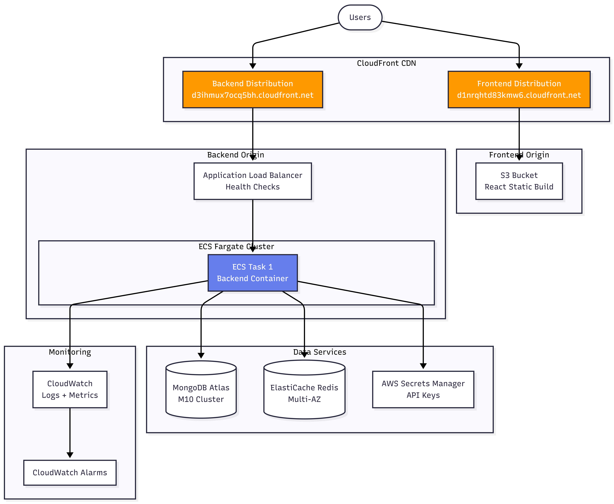

# MiniQuest - Complete Technical Documentation

**Version:** 1.0  
**Last Updated:** December 2025  
**Architecture:** Multi-Agent LangGraph System with Real-Time Research Powered by Tavily

---

## Table of Contents

1. [System Overview](#system-overview)
2. [Architecture](#architecture)
3. [Backend Components](#backend-components)
4. [Frontend Components](#frontend-components)
5. [Database Schema](#database-schema)
6. [API Endpoints](#api-endpoints)
7. [Authentication & Security](#authentication--security)
8. [Performance Optimizations](#performance-optimizations)
9. [Deployment](#deployment)
10. [Development Guide](#development-guide)

---

## 1. System Overview

### 1.1 Purpose
MiniQuest is a production-ready multi-agent system that generates personalized travel itineraries using real-time web research and RAG-based personalization. It combines 7 specialized AI agents coordinated by LangGraph to create complete, research-backed adventure plans.

### 1.2 Key Capabilities
- Real-time venue research using Tavily API
- Multi-agent workflow orchestration with LangGraph
- RAG-based personalization using ChromaDB
- Google Maps route optimization
- Parallel processing with intelligent caching
- User authentication and history tracking
- Real-time progress tracking

### 1.3 Technology Stack

**Backend:**
- Python 3.11
- FastAPI (REST API framework)
- LangGraph (agent orchestration)
- AsyncOpenAI (LLM provider)
- Tavily API (web research)
- MongoDB Atlas (primary database)
- ChromaDB (vector storage for RAG)
- Redis (caching layer)
- Google Maps API (routing)

**Frontend:**
- React 18 with TypeScript
- Vite (build tool)
- Axios (HTTP client)
- React Router (navigation)

**Infrastructure:**
- Docker & Docker Compose
- AWS (CloudFront, ECS, Elastic Beanstalk)
- MongoDB Atlas (cloud database)
- Redis (in-memory cache)

---

## 2. Architecture

### 2.1 High-Level Architecture


### 2.2 Data Flow

**Adventure Generation Flow:**


### 2.3 System Components Overview

| Component | Technology | Purpose | Location |
|-----------|-----------|---------|----------|
| API Server | FastAPI | REST endpoints, request handling | `backend/app/api/` |
| Coordinator | LangGraph | Agent orchestration, workflow | `backend/app/agents/coordination/` |
| Agents | OpenAI, Tavily | Specialized processing | `backend/app/agents/` |
| RAG System | ChromaDB | Personalization, learning | `backend/app/core/rag/` |
| Auth System | JWT, bcrypt | User authentication | `backend/app/core/auth/` |
| Database Layer | MongoDB, Redis | Persistence, caching | `backend/app/database/` |
| Frontend | React, TypeScript | User interface | `frontend/src/` |

---

## 3. Backend Components

### 3.1 LangGraph Coordinator

**File:** `backend/app/agents/coordination/langgraph_coordinator.py`

The coordinator orchestrates the entire multi-agent workflow using LangGraph's state graph pattern.

#### 3.1.1 Architecture

```python
class LangGraphCoordinator:
    """
    Orchestrates 7 agents in a sequential workflow with:
    - State management
    - Progress tracking
    - Error handling
    - Performance monitoring
    """
```


#### 3.1.2 Workflow Nodes

1. **parse_location_node**
   - Agent: LocationParserAgent
   - Input: User query, optional address
   - Output: Validated location with coordinates
   - Progress: 14%

2. **get_personalization_node**
   - Agent: RAG System (ChromaDB)
   - Input: User ID, location, preferences
   - Output: Historical preferences, favorite themes
   - Progress: 29%

3. **parse_intent_node**
   - Agent: IntentParserAgent
   - Input: User query
   - Output: Extracted themes, activities, constraints
   - Progress: 29%

4. **scout_venues_node**
   - Agent: VenueScoutAgent
   - Input: Preferences, location
   - Output: 15-20 candidate venues with addresses
   - Progress: 43%

5. **research_venues_node**
   - Agent: TavilyResearchAgent (parallel)
   - Input: Venue list
   - Output: Current hours, prices, reviews, descriptions
   - Progress: 57%
   - **Optimization:** Runs 8 venues concurrently

6. **summarize_research_node**
   - Agent: ResearchSummaryAgent
   - Input: Raw research results
   - Output: Structured venue summaries
   - Progress: 71%

7. **route_adventures_node**
   - Agent: EnhancedRoutingAgent
   - Input: Researched venues
   - Output: Google Maps routes, travel times
   - Progress: 86%

8. **create_adventures_node**
   - Agent: AdventureCreatorAgent (async)
   - Input: All previous outputs
   - Output: 3 complete themed adventures
   - Progress: 100%

#### 3.1.3 State Management

```python
class AdventureState(TypedDict):
    """Shared state across all agents"""
    
    # Input
    user_input: str
    user_address: Optional[str]
    user_id: Optional[str]
    
    # Location
    target_location: str
    coordinates: Dict
    
    # Preferences
    parsed_preferences: Dict
    user_personalization: Dict
    
    # Venues
    scouted_venues: List[Dict]
    researched_venues: List[Dict]
    
    # Output
    enhanced_locations: List[Dict]
    final_adventures: List[Dict]
    
    # Metadata
    performance: Dict
    error: Optional[str]
```

#### 3.1.4 Progress Tracking

Real-time progress updates are emitted through callbacks:

```python
def _emit_progress(self, update: Dict):
    """
    Emit progress update to frontend via callback
    
    Structure:
    {
        "step": "research_venues",
        "agent": "TavilyResearch",
        "status": "in_progress",
        "message": "Researching 8 venues...",
        "progress": 0.57,
        "details": {...}
    }
    """
```

#### 3.1.5 Performance Tracking

```python
def _track_timing(self, step: str, duration: float):
    """Track execution time per node"""
    self.timing_data[step] = duration
```

### 3.2 Agent Implementations

#### 3.2.1 Base Agent

**File:** `backend/app/agents/base.py`

```python
class BaseAgent:
    """
    Abstract base class for all agents
    
    Features:
    - Standardized logging
    - Error handling
    - Validation framework
    """
    
    def __init__(self, name: str):
        self.name = name
        self.logger = logging.getLogger(f"agent.{name.lower()}")
    
    async def process(self, input_data: Dict) -> Dict:
        """Abstract method - implemented by each agent"""
        raise NotImplementedError
```

#### 3.2.2 Intent Parser Agent

**File:** `backend/app/agents/intent/intent_parser.py`

**Purpose:** Extract structured preferences from natural language

**Process:**
1. Receive user query
2. Call OpenAI GPT-4 with structured prompt
3. Parse JSON response
4. Validate extracted fields

**Input:**
```python
{
    "user_input": "coffee shops and art galleries in Boston"
}
```

**Output:**
```python
{
    "preferences": ["coffee", "art", "culture"],
    "activities": ["cafe", "gallery", "museum"],
    "themes": ["artistic", "creative", "local"],
    "constraints": {
        "budget": "moderate",
        "duration": "half_day"
    }
}
```

**OpenAI Prompt Structure:**
```python
system_prompt = """
Extract user preferences from the query.
Return JSON with:
- preferences: List of interests
- activities: Specific activity types
- themes: Overall themes
- constraints: Any limitations
"""
```

#### 3.2.3 Location Parser Agent

**File:** `backend/app/agents/location/location_parser.py`

**Purpose:** Resolve and validate locations with coordinates

**Features:**
- Geocoding via OpenAI function calling
- Address validation
- Coordinate extraction
- Fallback to default location

**Process:**
1. Extract location from query or use provided address
2. Call OpenAI with geocoding function
3. Validate coordinates
4. Return structured location data

**Output:**
```python
{
    "location": "Boston, MA",
    "coordinates": {
        "lat": 42.3601,
        "lon": -71.0589
    },
    "city": "Boston",
    "state": "MA",
    "country": "USA"
}
```

#### 3.2.4 Venue Scout Agent

**File:** `backend/app/agents/scouting/venue_scout.py`

**Purpose:** Generate diverse venue candidates using GPT-4

**Strategy:**
- Request 15-20 venues per generation
- Enforce diversity across categories
- Include specific addresses
- Validate venues exist

**OpenAI Prompt:**
```python
system_prompt = f"""
Generate 15-20 diverse venues in {location} matching preferences: {preferences}

Requirements:
- Mix of popular and hidden gems
- Include EXACT addresses
- Diverse categories
- Real, verifiable venues

Return JSON array of venues.
"""
```

**Output:**
```python
[
    {
        "name": "Thinking Cup",
        "address": "165 Tremont St, Boston, MA 02111",
        "category": "coffee_shop",
        "description": "Artisan coffee with pastries"
    },
    # ... 14-19 more venues
]
```

#### 3.2.5 Tavily Research Agent

**File:** `backend/app/agents/research/tavily_research_agent.py`

**Purpose:** Real-time web research on venues with caching

**Key Features:**
- **Parallel Processing:** 8 concurrent venue researches
- **Smart Caching:** Redis with 24-hour TTL
- **Multi-Step Research:** Search → Extract for depth
- **Error Recovery:** Graceful degradation on API failures

**Process Flow:**
```python
async def research_venue(venue: Dict) -> Dict:
    # 1. Check cache
    cache_key = f"venue:{venue['name']}:{location}:{date}"
    cached = await redis.get(cache_key)
    if cached:
        return cached
    
    # 2. Tavily Search API
    search_results = tavily.search(
        query=f"{venue['name']} {location} hours prices reviews",
        search_depth="advanced",
        max_results=5
    )
    
    # 3. Tavily Extract API (deep dive)
    extract_results = tavily.extract(
        urls=[result['url'] for result in search_results],
        include_raw_content=False
    )
    
    # 4. Synthesize and cache
    research_data = synthesize(search_results, extract_results)
    await redis.set(cache_key, research_data, ex=86400)
    
    return research_data
```

**Parallel Execution:**
```python
async def process(self, input_data: Dict) -> Dict:
    venues = input_data["venues"]
    
    # Research 8 venues concurrently
    async with asyncio.TaskGroup() as tg:
        tasks = [
            tg.create_task(self._research_venue(v))
            for v in venues
        ]
    
    return {"researched_venues": [t.result() for t in tasks]}
```


**Cache Statistics:**
```python
{
    "total_requests": 100,
    "cache_hits": 91,
    "cache_misses": 9,
    "hit_rate": "91.0%",
    "time_saved_seconds": 182.4
}
```


**Output Structure:**
```python
{
    "venue_name": "Thinking Cup",
    "current_info": "Open today until 6 PM",
    "hours_info": "Mon-Fri: 7 AM - 6 PM, Sat-Sun: 8 AM - 5 PM",
    "visitor_tips": [
        "Try the cappuccino",
        "Arrive early on weekends",
        "Free WiFi available"
    ],
    "venue_summary": "Popular artisan coffee shop...",
    "research_confidence": 0.89,
    "total_insights": 12,
    "top_source": "thinkingcup.com"
}
```

#### 3.2.6 Research Summary Agent

**File:** `backend/app/agents/research/research_summary_agent.py`

**Purpose:** Synthesize raw research into structured summaries

**Process:**
1. Receive raw Tavily results per venue
2. Extract key information using GPT-4
3. Structure into consistent format
4. Calculate confidence scores

**OpenAI Prompt:**
```python
system_prompt = """
Analyze venue research and extract:
- Practical info (hours, prices, admission)
- Insider tips (3-4 actionable tips)
- Best time to visit
- What makes it special

Confidence: Rate 0-1 based on data quality
"""
```

**Output:**
```python
{
    "venue_name": "Museum of Fine Arts",
    "practical_info": {
        "hours": "Mon-Fri: 10 AM - 5 PM",
        "admission": "$27 adults, $25 seniors",
        "best_time": "Weekday mornings"
    },
    "insider_tips": [
        "Free admission on Wednesdays after 4 PM",
        "Start with the contemporary wing",
        "Café on the ground floor for breaks"
    ],
    "confidence_notes": "High confidence (12 sources)",
    "total_insights": 12
}
```

#### 3.2.7 Routing Agent

**File:** `backend/app/agents/routing/enhanced_routing_agent.py`

**Purpose:** Generate optimal routes using Google Maps Directions API

**Key Features:**
- Waypoint optimization
- Multiple travel modes (driving, walking, transit)
- Distance-based mode recommendations
- Fallback for cross-city travel

**Process:**
```python
async def calculate_route(venues: List[Dict]) -> Dict:
    # 1. Extract coordinates
    waypoints = [v['coordinates'] for v in venues]
    
    # 2. Determine optimal mode
    total_distance = calculate_distance(waypoints)
    mode = "walking" if total_distance < 5 else "driving"
    
    # 3. Call Google Maps Directions API
    result = gmaps.directions(
        origin=waypoints[0],
        destination=waypoints[-1],
        waypoints=waypoints[1:-1],
        mode=mode,
        optimize_waypoints=True
    )
    
    # 4. Generate shareable URL
    route_url = generate_google_maps_url(waypoints, mode)
    
    return {
        "route_url": route_url,
        "mode": mode,
        "total_distance": total_distance,
        "estimated_time": result['legs'][0]['duration']['text'],
        "optimized_order": result['waypoint_order']
    }
```

**URL Generation:**
```python
def generate_google_maps_url(waypoints, mode):
    """
    Generate shareable Google Maps URL
    
    Format: https://www.google.com/maps/dir/?api=1
            &origin=42.3601,-71.0589
            &destination=42.3584,-71.0598
            &waypoints=42.3593,-71.0603|...
            &travelmode=walking
    """
    origin = f"{waypoints[0]['lat']},{waypoints[0]['lon']}"
    destination = f"{waypoints[-1]['lat']},{waypoints[-1]['lon']}"
    waypoints_str = "|".join([
        f"{w['lat']},{w['lon']}" 
        for w in waypoints[1:-1]
    ])
    
    return (
        f"https://www.google.com/maps/dir/?api=1"
        f"&origin={origin}"
        f"&destination={destination}"
        f"&waypoints={waypoints_str}"
        f"&travelmode={mode}"
    )
```

**Output:**
```python
{
    "routing_available": true,
    "primary_route_url": "https://www.google.com/maps/dir/?api=1...",
    "recommended_mode": "walking",
    "distance_category": "walkable",
    "travel_options": [
        {
            "mode": "walking",
            "url": "...",
            "description": "~2.3 miles, 45 min",
            "recommended": true
        },
        {
            "mode": "transit",
            "url": "...",
            "description": "Use Red Line",
            "recommended": false
        }
    ]
}
```

#### 3.2.8 Adventure Creator Agent

**File:** `backend/app/agents/creation/adventure_creator.py`

**Purpose:** Generate final themed adventures with narratives

**Key Features:**
- **Async execution:** Uses AsyncOpenAI for speed
- **Theme generation:** Creates unique themes per adventure
- **Narrative weaving:** Integrates research into stories
- **Research preservation:** Maintains venue details

**Process:**
```python
async def create_adventures(
    researched_venues: List[Dict],
    enhanced_locations: List[Dict],
    preferences: Dict,
    personalization: Dict
) -> List[Dict]:
    
    # 1. Generate 3 themed adventures using GPT-4
    adventures = await self._generate_base_adventures(
        researched_venues, 
        preferences,
        personalization
    )
    
    # 2. Integrate research data
    for adventure in adventures:
        adventure = self._integrate_research(
            adventure, 
            researched_venues
        )
    
    # 3. Add route information
    for adventure in adventures:
        adventure = self._add_routing(
            adventure,
            enhanced_locations
        )
    
    return adventures
```

**GPT-4 Prompt Structure:**
```python
system_prompt = """
Create 3 unique themed adventures from venues.

Requirements:
- Different theme per adventure
- 4-6 hour duration
- Compelling narrative
- Specific timeline
- Insider tips integration

CRITICAL: Only use provided venues, no hallucinations.

Return JSON with structure:
{
    "title": "...",
    "theme": "...",
    "description": "...",
    "duration": 5,
    "cost": 40,
    "steps": [
        {
            "time": "10:00 AM",
            "activity": "Coffee at Thinking Cup",
            "details": "...",
            "venue_ref": "Thinking Cup"
        }
    ]
}
"""
```

**Research Integration:**
```python
def _integrate_research(adventure, researched_venues):
    """Add research summaries to adventure steps"""
    for step in adventure['steps']:
        venue_name = step.get('venue_ref')
        research = find_research(venue_name, researched_venues)
        
        if research:
            step['venue_research'] = {
                'hours_info': research['hours_info'],
                'visitor_tips': research['visitor_tips'],
                'venue_summary': research['venue_summary']
            }
    
    return adventure
```

**Final Adventure Structure:**
```python
{
    "title": "Coffee & Culture Tour",
    "theme": "Artistic Coffee Journey",
    "tagline": "Discover Boston's café culture and artistic soul",
    "description": "A half-day adventure...",
    "duration": 4.5,
    "cost": 35,
    "steps": [
        {
            "time": "10:00 AM",
            "activity": "Morning Coffee",
            "details": "Start at Thinking Cup...",
            "insider_tip": "Try their signature cappuccino",
            "venue_research": {
                "hours_info": "Open 7 AM - 6 PM",
                "visitor_tips": ["Arrive before 11 AM", ...],
                "venue_summary": "Popular artisan coffee shop..."
            }
        },
        # ... more steps
    ],
    "map_url": "https://www.google.com/maps/dir/?...",
    "routing_info": {
        "recommended_mode": "walking",
        "total_distance": "2.3 miles"
    },
    "venues_research": [/* full research data */]
}
```

### 3.3 RAG System

**Files:** `backend/app/core/rag/`

The RAG (Retrieval-Augmented Generation) system provides personalization by learning from user history.

#### 3.3.1 Architecture


#### 3.3.2 Chroma Manager

**File:** `backend/app/core/rag/chroma_manager.py`

**Purpose:** Manage ChromaDB collections for RAG

**Collections:**

1. **user_adventure_history**
   - Stores user's saved adventures
   - Used for preference extraction
   - Enables "learn from past" feature

2. **dynamic_location_tips**
   - Caches location-specific insider tips
   - Discovered via Tavily searches
   - 24-hour freshness

**Key Methods:**

```python
def store_user_adventure(
    user_id: str, 
    adventure_data: Dict, 
    rating: Optional[int]
):
    """
    Store user adventure for personalization
    
    Process:
    1. Format adventure as document
    2. Generate embeddings via OpenAI
    3. Store in ChromaDB with metadata
    """
    adventure_doc = f"""
    Title: {adventure_data['title']}
    Theme: {adventure_data['theme']}
    Venues: {', '.join([v['name'] for v in venues])}
    Rating: {rating}/5
    """
    
    self.user_history_collection.add(
        ids=[f"user_{user_id}_adventure_{timestamp}"],
        documents=[adventure_doc],
        metadatas=[{
            "user_id": user_id,
            "rating": rating,
            "location": location,
            "timestamp": timestamp
        }]
    )
```

```python
def get_user_personalization(user_id: str, location: str) -> Dict:
    """
    Retrieve user personalization
    
    Process:
    1. Query ChromaDB by user_id
    2. Extract favorite themes
    3. Calculate statistics
    4. Return structured preferences
    """
    results = self.user_history_collection.query(
        query_texts=[f"adventures in {location}"],
        where={"user_id": user_id},
        n_results=20
    )
    
    # Analyze results
    favorite_themes = extract_themes(results)
    avg_rating = calculate_avg_rating(results)
    favorite_locations = extract_locations(results)
    
    return {
        "has_history": len(results) > 0,
        "favorite_themes": favorite_themes,
        "avg_rating": avg_rating,
        "total_adventures": len(results),
        "favorite_locations": favorite_locations
    }
```

#### 3.3.3 Personalization Flow


**Personalization Data Structure:**
```python
{
    "has_history": true,
    "favorite_themes": ["coffee", "art", "culture"],
    "preferred_venue_types": ["cafe", "gallery", "museum"],
    "avg_rating": 4.3,
    "total_adventures": 7,
    "favorite_locations": ["Boston", "Cambridge"]
}
```

### 3.4 Research Caching System

**File:** `backend/app/agents/research/research_cache.py`

**Purpose:** Redis-based caching to minimize Tavily API calls

#### 3.4.1 Cache Strategy

**Key Format:**
```python
cache_key = f"venue:{venue_name}:{location}:{date}"
# Example: "venue:Thinking Cup:Boston:2025-01-15"
```

**TTL:** 24 hours (86400 seconds)

**Cache Hit Decision:**
```python
async def get_cached_research(venue: str, location: str) -> Optional[Dict]:
    today = datetime.now().strftime("%Y-%m-%d")
    cache_key = f"venue:{venue}:{location}:{today}"
    
    cached = await redis.get(cache_key)
    if cached:
        return json.loads(cached)
    return None
```

#### 3.4.2 Performance Impact

**Without Cache:**
- Average research time: 2.5 seconds/venue
- 8 venues = 20 seconds total

**With Cache (90% hit rate):**
- Cache hits: 7 venues × 0.1s = 0.7s
- Cache misses: 1 venue × 2.5s = 2.5s
- Total: 3.2 seconds (84% faster)

**Cache Statistics:**
```python
{
    "total_requests": 1000,
    "cache_hits": 910,
    "cache_misses": 90,
    "hit_rate": "91.0%",
    "time_saved_seconds": 2273,
    "cache_size_mb": 4.2
}
```

### 3.5 Authentication System

**Files:** `backend/app/core/auth/`

#### 3.5.1 Architecture


#### 3.5.2 Password Manager

**File:** `backend/app/core/auth/password_manager.py`

**Purpose:** Secure password hashing and verification

**Implementation:**
```python
from passlib.context import CryptContext

class PasswordManager:
    def __init__(self):
        self.pwd_context = CryptContext(
            schemes=["bcrypt"],
            deprecated="auto"
        )
    
    def hash_password(self, password: str) -> str:
        """Hash password with bcrypt"""
        return self.pwd_context.hash(password)
    
    def verify_password(self, plain: str, hashed: str) -> bool:
        """Verify password against hash"""
        return self.pwd_context.verify(plain, hashed)
```

**Security Features:**
- bcrypt algorithm (industry standard)
- Automatic salt generation
- Cost factor: 12 (secure but performant)
- Protection against timing attacks

#### 3.5.3 JWT Manager

**File:** `backend/app/core/auth/jwt_manager.py`

**Purpose:** JWT token creation and validation

**Token Structure:**
```python
{
    "sub": "user@example.com",  # Subject (email)
    "user_id": "507f1f77bcf86cd799439011",
    "exp": 1640995200  # Expiration timestamp
}
```

**Implementation:**
```python
from jose import jwt, JWTError
from datetime import datetime, timedelta

class JWTManager:
    def __init__(self, secret_key: str, algorithm: str = "HS256"):
        self.secret_key = secret_key
        self.algorithm = algorithm
    
    def create_access_token(
        self, 
        data: Dict, 
        expires_delta: Optional[timedelta] = None
    ) -> str:
        """Create JWT token"""
        to_encode = data.copy()
        
        if expires_delta:
            expire = datetime.utcnow() + expires_delta
        else:
            expire = datetime.utcnow() + timedelta(minutes=30)
        
        to_encode["exp"] = expire
        
        return jwt.encode(
            to_encode, 
            self.secret_key, 
            algorithm=self.algorithm
        )
    
    def decode_token(self, token: str) -> Optional[Dict]:
        """Decode and validate token"""
        try:
            payload = jwt.decode(
                token, 
                self.secret_key, 
                algorithms=[self.algorithm]
            )
            return payload
        except JWTError:
            return None
```

#### 3.5.4 Auth Handler

**File:** `backend/app/core/auth/auth_handler.py`

**Purpose:** Orchestrate authentication flows

**Registration Flow:**
```python
async def register_user(user_create: UserCreate) -> Dict:
    # 1. Check if user exists
    existing = await db.get_user_by_email(user_create.email)
    if existing:
        raise HTTPException(400, "User exists")
    
    # 2. Hash password
    hashed = password_manager.hash_password(user_create.password)
    
    # 3. Create user document
    user_data = {
        "email": user_create.email,
        "username": user_create.username,
        "full_name": user_create.full_name,
        "hashed_password": hashed,
        "is_active": True,
        "created_at": datetime.now(),
        "total_queries": 0
    }
    
    # 4. Store in MongoDB
    user_id = await db.create_user(user_data)
    
    # 5. Generate JWT token
    token = jwt_manager.create_access_token({
        "sub": user_create.email,
        "user_id": str(user_id)
    })
    
    return {
        "access_token": token,
        "token_type": "bearer",
        "user": format_user(user_data)
    }
```

**Authentication Flow:**
```python
async def authenticate_user(user_login: UserLogin) -> Dict:
    # 1. Get user from database
    user = await db.get_user_by_email(user_login.email)
    
    # 2. Verify password
    if not user or not password_manager.verify_password(
        user_login.password,
        user["hashed_password"]
    ):
        raise HTTPException(401, "Invalid credentials")
    
    # 3. Generate token
    token = jwt_manager.create_access_token({
        "sub": user["email"],
        "user_id": str(user["_id"])
    })
    
    return {
        "access_token": token,
        "token_type": "bearer",
        "user": format_user(user)
    }
```


**Token Validation:**
```python
async def get_current_user(
    credentials: HTTPAuthorizationCredentials
) -> Dict:
    # 1. Extract token
    token = credentials.credentials
    
    # 2. Decode token
    payload = jwt_manager.decode_token(token)
    if not payload:
        raise HTTPException(401, "Invalid token")
    
    # 3. Get user from database
    email = payload.get("sub")
    user = await db.get_user_by_email(email)
    if not user:
        raise HTTPException(401, "User not found")
    
    return format_user(user)
```

---

## 4. Frontend Components

### 4.1 Application Structure

**File:** `frontend/src/App.tsx`

```typescript
function App() {
    return (
        <AuthProvider>
            <BrowserRouter>
                <NavigationBar />
                <Routes>
                    {/* Public Routes */}
                    <Route path="/" element={<HomePage />} />
                    <Route path="/login" element={<PublicRoute><LoginPage /></PublicRoute>} />
                    <Route path="/register" element={<PublicRoute><RegisterPage /></PublicRoute>} />
                    <Route path="/about" element={<AboutPage />} />
                    
                    {/* Protected Routes */}
                    <Route path="/app" element={<ProtectedRoute><AdventuresPage /></ProtectedRoute>} />
                    <Route path="/analytics" element={<ProtectedRoute><AnalyticsPage /></ProtectedRoute>} />
                    <Route path="/saved-adventures" element={<ProtectedRoute><SavedAdventuresPage /></ProtectedRoute>} />
                </Routes>
            </BrowserRouter>
        </AuthProvider>
    );
}
```

### 4.2 Authentication Context

**File:** `frontend/src/contexts/AuthContext.tsx`

**Purpose:** Global authentication state management

```typescript
interface AuthContextType {
    user: User | null;
    token: string | null;
    isAuthenticated: boolean;
    loading: boolean;
    login: (email: string, password: string) => Promise<void>;
    register: (data: RegisterData) => Promise<void>;
    logout: () => void;
}

export const AuthProvider: React.FC<Props> = ({ children }) => {
    const [user, setUser] = useState<User | null>(null);
    const [token, setToken] = useState<string | null>(null);
    const [loading, setLoading] = useState(true);
    
    // Load token from localStorage on mount
    useEffect(() => {
        const savedToken = localStorage.getItem('token');
        if (savedToken) {
            setToken(savedToken);
            validateToken(savedToken);
        }
        setLoading(false);
    }, []);
    
    const login = async (email: string, password: string) => {
        const response = await api.post('/auth/login', { email, password });
        const { access_token, user } = response.data;
        
        localStorage.setItem('token', access_token);
        setToken(access_token);
        setUser(user);
    };
    
    // ... more methods
};
```

### 4.3 Adventures Page

**File:** `frontend/src/pages/AdventuresPage.tsx`

**Purpose:** Main adventure generation interface

**Key Features:**
- Query input with examples
- Real-time progress tracking
- Adventure card display
- Save to favorites

**State Management:**
```typescript
const [query, setQuery] = useState('');
const [loading, setLoading] = useState(false);
const [adventures, setAdventures] = useState<Adventure[]>([]);
const [metadata, setMetadata] = useState<AdventureMetadata | null>(null);
const [currentProgress, setCurrentProgress] = useState<ProgressUpdate | null>(null);
const [progressHistory, setProgressHistory] = useState<ProgressUpdate[]>([]);
```

**Generation Flow:**
```typescript
const handleGenerate = async () => {
    setLoading(true);
    setProgressHistory([]);
    
    try {
        const response = await api.post('/adventures', {
            user_input: query,
            enable_progress: true
        });
        
        // Stream progress updates
        const reader = response.body.getReader();
        while (true) {
            const { done, value } = await reader.read();
            if (done) break;
            
            const progress = JSON.parse(new TextDecoder().decode(value));
            setCurrentProgress(progress);
            setProgressHistory(prev => [...prev, progress]);
        }
        
        // Get final result
        const result = await response.json();
        setAdventures(result.adventures);
        setMetadata(result.metadata);
    } catch (error) {
        handleError(error);
    } finally {
        setLoading(false);
    }
};
```

### 4.4 Progress Tracker Component

**File:** `frontend/src/components/ProgressTracker.tsx`

**Purpose:** Real-time visual feedback during generation

**Features:**
- Animated progress bar
- Agent-specific emojis
- Step-by-step status
- Details expansion

```typescript
const ProgressTracker: React.FC<Props> = ({
    currentProgress,
    progressHistory,
    isVisible
}) => {
    const getAgentEmoji = (agent: string): string => {
        const map = {
            'LocationParser': '📍',
            'IntentParser': '🤔',
            'VenueScout': '🔍',
            'TavilyResearch': '🔬',
            'RoutingAgent': '🗺️',
            'AdventureCreator': '✨'
        };
        return map[agent] || '⚙️';
    };
    
    return (
        <div className="progress-tracker">
            {/* Progress Bar */}
            <div className="progress-bar">
                <div 
                    className="progress-fill"
                    style={{ width: `${currentProgress?.progress * 100}%` }}
                />
            </div>
            
            {/* Current Step */}
            <div className="current-step">
                <span>{getAgentEmoji(currentProgress?.agent)}</span>
                <span>{currentProgress?.message}</span>
            </div>
            
            {/* History */}
            {progressHistory.map((step, idx) => (
                <div key={idx} className="history-step">
                    {step.message}
                </div>
            ))}
        </div>
    );
};
```

### 4.5 Adventure Card Component

**File:** `frontend/src/components/EnhancedAdventureCard.tsx`

**Purpose:** Display single adventure with all details

**Sections:**
1. Header (title, theme, tagline)
2. Stats (duration, cost)
3. Description
4. Researched venues with details
5. Itinerary timeline
6. Map integration
7. Save button

```typescript
const EnhancedAdventureCard: React.FC<Props> = ({ adventure, onSave }) => {
    const [expanded, setExpanded] = useState(false);
    const [saving, setSaving] = useState(false);
    
    const handleSave = async (rating: number, notes: string) => {
        setSaving(true);
        try {
            await api.post('/saved-adventures', {
                adventure_data: adventure,
                rating,
                notes
            });
            toast.success('Adventure saved!');
        } catch (error) {
            toast.error('Failed to save');
        } finally {
            setSaving(false);
        }
    };
    
    return (
        <div className="adventure-card">
            {/* Header */}
            <div className="header">
                <h2>{adventure.title}</h2>
                <p className="theme">{adventure.theme}</p>
                <p className="tagline">{adventure.tagline}</p>
            </div>
            
            {/* Stats */}
            <div className="stats">
                <StatBadge icon="⏱️" label="Duration" value={`${adventure.duration}h`} />
                <StatBadge icon="💰" label="Cost" value={`$${adventure.cost}`} />
            </div>
            
            {/* Researched Venues */}
            {adventure.venues_research?.map(venue => (
                <VenueDetails key={venue.name} venue={venue} />
            ))}
            
            {/* Itinerary */}
            {adventure.steps.map(step => (
                <TimelineStep key={step.time} step={step} />
            ))}
            
            {/* Map */}
            {adventure.map_url && (
                <a href={adventure.map_url} target="_blank">
                    🗺️ Open in Google Maps
                </a>
            )}
            
            {/* Save Button */}
            <SaveButton onSave={handleSave} loading={saving} />
        </div>
    );
};
```

### 4.6 Analytics Page

**File:** `frontend/src/pages/AnalyticsPage.tsx`

**Purpose:** User statistics and insights

**Metrics Displayed:**
- Total adventures generated
- Favorite themes
- Top locations
- Average ratings
- Cache performance
- Research statistics

```typescript
const AnalyticsPage: React.FC = () => {
    const [analytics, setAnalytics] = useState<Analytics | null>(null);
    
    useEffect(() => {
        fetchAnalytics();
    }, []);
    
    const fetchAnalytics = async () => {
        const response = await api.get('/analytics/summary');
        setAnalytics(response.data);
    };
    
    return (
        <div className="analytics-page">
            <h1>Your Adventure Analytics</h1>
            
            <div className="stats-grid">
                <StatCard 
                    value={analytics.total_adventures}
                    label="Adventures Generated"
                    color="#667eea"
                />
                <StatCard 
                    value={analytics.avg_rating.toFixed(1)}
                    label="Average Rating"
                    color="#f59e0b"
                />
            </div>
            
            <div className="themes-section">
                <h2>Favorite Themes</h2>
                {analytics.favorite_themes.map((theme, idx) => (
                    <ThemeCard 
                        key={theme}
                        theme={theme}
                        rank={idx + 1}
                        count={analytics.theme_counts[theme]}
                    />
                ))}
            </div>
        </div>
    );
};
```

### 4.7 Common Components

**Directory:** `frontend/src/components/common/`

**Reusable UI Components:**

1. **BackgroundOrbs** - Glassmorphism decoration
2. **GlassCard** - Frosted glass container
3. **GlassInput** - Styled input field
4. **GlassButton** - Styled button
5. **LoadingState** - Loading spinner
6. **EmptyState** - No data placeholder
7. **StatBadge** - Metric display
8. **ThemeCard** - Theme ranking card

**Example: GlassCard**
```typescript
const GlassCard: React.FC<Props> = ({ children, className }) => (
    <div className={`glass-card ${className}`}>
        {children}
    </div>
);

// CSS
.glass-card {
    background: rgba(255, 255, 255, 0.15);
    backdrop-filter: blur(10px);
    border: 1px solid rgba(255, 255, 255, 0.2);
    border-radius: 16px;
    padding: 24px;
}
```

---

## 5. Database Schema


### 5.1 MongoDB Collections

#### 5.1.1 users Collection

**Purpose:** Store user account information

```json
{
    "_id": ObjectId("507f1f77bcf86cd799439011"),
    "email": "user@example.com",
    "username": "johndoe",
    "full_name": "John Doe",
    "hashed_password": "$2b$12$...",
    "is_active": true,
    "created_at": ISODate("2025-01-15T10:30:00Z"),
    "updated_at": ISODate("2025-01-15T10:30:00Z"),
    "total_queries": 15,
    "preferences": {
        "default_location": "Boston, MA",
        "notification_email": true
    }
}
```

**Indexes:**
```javascript
db.users.createIndex({ "email": 1 }, { unique: true })
db.users.createIndex({ "username": 1 }, { unique: true })
db.users.createIndex({ "created_at": -1 })
```

#### 5.1.2 user_queries Collection (Lightweight)

**Purpose:** Store query metadata without full adventures (privacy-focused)

**Schema Philosophy:**
- Only store query text and metadata
- Adventures stored as minimal metadata (title, theme)
- Full adventures only in saved_adventures (user-triggered)

```json
{
    "_id": ObjectId("507f1f77bcf86cd799439012"),
    "user_id": ObjectId("507f1f77bcf86cd799439011"),
    "user_input": "coffee shops and museums in Boston",
    "adventures_count": 3,
    "adventure_metadata": [
        {
            "title": "Coffee & Culture Tour",
            "theme": "Artistic Coffee Journey"
        },
        {
            "title": "Museum Morning",
            "theme": "Art & History"
        },
        {
            "title": "Hidden Gems",
            "theme": "Local Discoveries"
        }
    ],
    "metadata": {
        "target_location": "Boston, MA",
        "performance": {
            "total_time_seconds": 4.2,
            "cache_hits": 7,
            "cache_misses": 1,
            "cache_hit_rate": "87.5%",
            "time_saved_estimate": "~18.2 seconds"
        },
        "personalization": {
            "applied": true,
            "has_history": true,
            "favorite_themes": ["coffee", "art"],
            "enhanced_query": "coffee shops museums art culture Boston"
        },
        "research_stats": {
            "total_venues": 8,
            "successful_research": 8,
            "total_insights": 96,
            "avg_confidence": 0.87
        }
    },
    "created_at": ISODate("2025-01-15T14:22:15Z"),
    "system_info": {
        "workflow": "LangGraph Multi-Agent",
        "data_source": "Tavily API",
        "llm_provider": "OpenAI",
        "schema_version": "lightweight_v1"
    }
}
```

**Storage Comparison:**
- **Lightweight query:** ~500 bytes
- **Full query with adventures:** ~15,000 bytes
- **Savings:** 97% reduction in storage

**Indexes:**
```javascript
db.user_queries.createIndex({ "user_id": 1, "created_at": -1 })
db.user_queries.createIndex({ "created_at": -1 })
db.user_queries.createIndex({ "metadata.target_location": 1 })
```

#### 5.1.3 saved_adventures Collection

**Purpose:** Store full adventure details (user-triggered save only)

```json
{
    "_id": ObjectId("507f1f77bcf86cd799439013"),
    "user_id": ObjectId("507f1f77bcf86cd799439011"),
    "adventure_data": {
        "title": "Coffee & Culture Tour",
        "theme": "Artistic Coffee Journey",
        "tagline": "Discover Boston's café culture and art scene",
        "description": "A half-day adventure...",
        "duration": 4.5,
        "cost": 35,
        "steps": [
            {
                "time": "10:00 AM",
                "activity": "Morning Coffee",
                "details": "Start at Thinking Cup...",
                "insider_tip": "Try their signature cappuccino",
                "venue_research": {
                    "hours_info": "Mon-Fri: 7 AM - 6 PM",
                    "visitor_tips": ["Arrive early", "Try the pastries"],
                    "venue_summary": "Popular artisan coffee shop..."
                }
            }
        ],
        "venues_research": [/* full research data */],
        "map_url": "https://www.google.com/maps/dir/?...",
        "routing_info": {
            "recommended_mode": "walking",
            "total_distance": "2.3 miles",
            "estimated_time": "45 minutes"
        }
    },
    "rating": 5,
    "notes": "Loved this itinerary! Great recommendations.",
    "tags": ["coffee", "art", "walking"],
    "saved_at": ISODate("2025-01-15T16:45:00Z"),
    "completed": false,
    "completed_at": null,
    "updated_at": ISODate("2025-01-15T16:45:00Z"),
    "metadata": {
        "location": "Boston, MA",
        "title": "Coffee & Culture Tour",
        "theme": "Artistic Coffee Journey",
        "duration": 4.5,
        "cost": 35,
        "preferences_used": ["coffee", "art", "culture"]
    }
}
```

**Indexes:**
```javascript
db.saved_adventures.createIndex({ "user_id": 1, "saved_at": -1 })
db.saved_adventures.createIndex({ "metadata.location": 1 })
db.saved_adventures.createIndex({ "tags": 1 })
db.saved_adventures.createIndex({ "completed": 1 })
```

#### 5.1.4 chat_conversations Collection

**Purpose:** Store chat history (NOT conversations - collection name is legacy)

```json
{
    "_id": ObjectId("507f1f77bcf86cd799439014"),
    "user_id": ObjectId("507f1f77bcf86cd799439011"),
    "messages": [
        {
            "role": "user",
            "content": "Tell me about coffee shops in Boston",
            "timestamp": ISODate("2025-01-15T10:00:00Z")
        },
        {
            "role": "assistant",
            "content": "Boston has excellent coffee culture...",
            "timestamp": ISODate("2025-01-15T10:00:05Z")
        }
    ],
    "created_at": ISODate("2025-01-15T10:00:00Z"),
    "updated_at": ISODate("2025-01-15T10:00:05Z"),
    "message_count": 2
}
```

**Indexes:**
```javascript
db.chat_conversations.createIndex({ "user_id": 1, "updated_at": -1 })
```

### 5.2 ChromaDB Collections

#### 5.2.1 user_adventure_history

**Purpose:** Vector embeddings of saved adventures for RAG

**Document Structure:**
```python
{
    "id": "user_123_adventure_1640995200",
    "document": """
        Title: Coffee & Culture Tour
        Theme: Artistic Coffee Journey
        Venues: Thinking Cup, MFA Boston, Trident Booksellers
        Rating: 5/5
        Location: Boston, MA
    """,
    "metadata": {
        "user_id": "user_123",
        "rating": 5,
        "location": "Boston, MA",
        "timestamp": "2025-01-15T16:45:00Z",
        "themes": ["coffee", "art", "culture"]
    },
    "embedding": [0.123, -0.456, ...] # OpenAI embedding
}
```

**Query Example:**
```python
results = collection.query(
    query_texts=["coffee shops and art galleries"],
    where={"user_id": "user_123"},
    n_results=10
)
```

#### 5.2.2 dynamic_location_tips

**Purpose:** Cache location-specific insider tips from Tavily

**Document Structure:**
```python
{
    "id": "boston_coffee_tip_1",
    "document": "Local tip: Visit Thinking Cup before 11 AM to avoid crowds",
    "metadata": {
        "location": "Boston",
        "category": "coffee",
        "authenticity_score": 0.92,
        "source_domain": "thinkingcup.com",
        "discovered_at": "2025-01-15T10:30:00Z"
    },
    "embedding": [0.789, -0.234, ...]
}
```

### 5.3 Redis Cache Structure

**Purpose:** Temporary caching of research results

**Key Format:**
```
venue:{venue_name}:{location}:{date}
```

**Value Structure:**
```json
{
    "venue_name": "Thinking Cup",
    "current_info": "Open today until 6 PM",
    "hours_info": "Mon-Fri: 7 AM - 6 PM",
    "visitor_tips": ["Try the cappuccino", "Arrive early"],
    "venue_summary": "Popular artisan coffee shop...",
    "research_confidence": 0.89,
    "total_insights": 12,
    "cached_at": "2025-01-15T10:00:00Z"
}
```

**TTL:** 86400 seconds (24 hours)

**Example Keys:**
```
venue:Thinking Cup:Boston:2025-01-15
venue:Museum of Fine Arts:Boston:2025-01-15
venue:Trident Booksellers:Boston:2025-01-15
```

---

## 6. API Endpoints


### 6.1 Authentication Endpoints

**Base URL:** `/api/auth`

#### POST /auth/register
Register new user

**Request:**
```json
{
    "email": "user@example.com",
    "username": "johndoe",
    "full_name": "John Doe",
    "password": "securepassword123"
}
```

**Response:**
```json
{
    "access_token": "eyJhbGciOiJIUzI1NiIsInR5cCI6IkpXVCJ9...",
    "token_type": "bearer",
    "user": {
        "id": "507f1f77bcf86cd799439011",
        "email": "user@example.com",
        "username": "johndoe",
        "full_name": "John Doe"
    }
}
```

#### POST /auth/login
Authenticate user

**Request:**
```json
{
    "email": "user@example.com",
    "password": "securepassword123"
}
```

**Response:**
```json
{
    "access_token": "eyJhbGciOiJIUzI1NiIsInR5cCI6IkpXVCJ9...",
    "token_type": "bearer",
    "user": {
        "id": "507f1f77bcf86cd799439011",
        "email": "user@example.com",
        "username": "johndoe"
    }
}
```

#### GET /auth/me
Get current user
- **Auth Required:** Yes
- **Returns:** Current user object

### 6.2 Adventure Generation Endpoints

**Base URL:** `/api/adventures`

#### POST /adventures
Generate adventures

**Request:**
```json
{
    "user_input": "coffee shops and museums in Boston",
    "user_address": null,
    "enable_progress": true
}
```

**Response:**
```json
{
    "success": true,
    "adventures": [
        {
            "title": "Coffee & Culture Tour",
            "theme": "Artistic Coffee Journey",
            "tagline": "Discover Boston's café culture and art scene",
            "description": "A half-day adventure...",
            "duration": 4.5,
            "cost": 35,
            "steps": [...],
            "map_url": "https://www.google.com/maps/dir/?...",
            "routing_info": {...},
            "venues_research": [...]
        }
    ],
    "metadata": {
        "target_location": "Boston, MA",
        "total_adventures": 3,
        "personalization_applied": true,
        "performance": {
            "total_time_seconds": 4.2,
            "cache_hit_rate": "87.5%"
        }
    }
}
```

**Progress Updates (Streaming):**
```json
{"step": "parse_location", "agent": "LocationParser", "progress": 0.14, "message": "Resolving location..."}
{"step": "scout_venues", "agent": "VenueScout", "progress": 0.43, "message": "Discovering venues..."}
{"step": "research_venues", "agent": "TavilyResearch", "progress": 0.57, "message": "Researching 8 venues..."}
{"step": "create_adventures", "agent": "AdventureCreator", "progress": 1.0, "message": "Created 3 adventures"}
```

#### GET /adventures/cache-stats
Get research cache statistics
- **Auth Required:** Yes

**Response:**
```json
{
    "cache_stats": {
        "total_requests": 1000,
        "cache_hits": 910,
        "cache_misses": 90,
        "hit_rate": "91.0%",
        "time_saved_seconds": 2273
    },
    "cache_enabled": true
}
```

#### POST /adventures/clear-cache
Clear research cache
- **Auth Required:** Yes

### 6.3 Saved Adventures Endpoints

**Base URL:** `/api/saved-adventures`

#### POST /saved-adventures
Save adventure

**Request:**
```json
{
    "adventure_data": {...},
    "rating": 5,
    "notes": "Loved this itinerary!",
    "tags": ["coffee", "art"]
}
```

**Response:**
```json
{
    "success": true,
    "adventure_id": "507f1f77bcf86cd799439013",
    "message": "Adventure saved successfully"
}
```

#### GET /saved-adventures
Get user's saved adventures
- **Auth Required:** Yes
- **Query Params:** `limit` (default: 20), `completed` (optional)

**Response:**
```json
{
    "success": true,
    "adventures": [...],
    "total": 15
}
```

#### GET /saved-adventures/{id}
Get specific saved adventure
- **Auth Required:** Yes

#### PUT /saved-adventures/{id}
Update saved adventure (rating, notes, completed status)
- **Auth Required:** Yes

#### DELETE /saved-adventures/{id}
Delete saved adventure
- **Auth Required:** Yes

#### GET /saved-adventures/personalization/insights
Get personalization insights
- **Auth Required:** Yes

**Response:**
```json
{
    "insights": {
        "has_history": true,
        "total_adventures": 7,
        "avg_rating": 4.3,
        "favorite_themes": ["coffee", "art", "culture"],
        "favorite_locations": ["Boston", "Cambridge"]
    }
}
```

### 6.4 Analytics Endpoints

**Base URL:** `/api/analytics`

#### GET /analytics/summary
Get user analytics summary
- **Auth Required:** Yes

**Response:**
```json
{
    "total_queries": 25,
    "total_adventures": 75,
    "avg_adventures_per_query": 3.0,
    "favorite_themes": ["coffee", "art", "culture"],
    "theme_counts": {
        "coffee": 15,
        "art": 12,
        "culture": 10
    },
    "top_locations": ["Boston", "Cambridge", "Somerville"],
    "recent_queries_24h": 3,
    "avg_rating": 4.3
}
```

### 6.5 System Endpoints

**Base URL:** `/api`

#### GET /health
Health check (no auth required)

**Response:**
```json
{
    "status": "healthy",
    "timestamp": "2025-01-15T10:00:00Z"
}
```

#### GET /api/status
System status with component checks
- **Auth Required:** No

**Response:**
```json
{
    "status": "operational",
    "components": {
        "mongodb": "connected",
        "redis": "connected",
        "chromadb": "initialized",
        "tavily_api": "available",
        "openai_api": "available"
    },
    "version": "1.0.0"
}
```

---

## 7. Authentication & Security

### 7.1 JWT Token Flow

```
1. User Login
   ├→ POST /auth/login
   ├→ Verify credentials (bcrypt)
   └→ Generate JWT token
       {
           "sub": "user@example.com",
           "user_id": "507f...",
           "exp": 1640995200
       }

2. Store Token
   ├→ Frontend: localStorage.setItem('token', token)
   └→ Set Authorization header for subsequent requests

3. API Request
   ├→ Extract token from Authorization header
   ├→ Verify JWT signature
   ├→ Check expiration
   └→ Load user from database

4. Token Refresh
   ├→ Tokens expire after 30 minutes
   └→ User must re-authenticate
```

### 7.2 Security Features

#### Password Security
- **Algorithm:** bcrypt
- **Cost Factor:** 12
- **Salt:** Automatically generated per password
- **Timing Attack Protection:** Built into bcrypt

#### JWT Security
- **Algorithm:** HS256
- **Secret Key:** 256-bit random string
- **Expiration:** 30 minutes (configurable)
- **Signature Verification:** On every request

#### API Security
- **CORS:** Configured for specific origins
- **Rate Limiting:** 100 requests/minute per IP (production)
- **Input Validation:** Pydantic models
- **SQL Injection:** N/A (MongoDB)
- **XSS Protection:** React escapes by default

#### Environment Variables
- **Storage:** AWS Secrets Manager (production)
- **Local:** `.env` file (not committed)
- **Required Keys:**
  - `OPENAI_API_KEY`
  - `TAVILY_API_KEY`
  - `MONGODB_URL`
  - `JWT_SECRET_KEY`

### 7.3 Protected Routes

**Frontend:**
```typescript
const ProtectedRoute: React.FC<Props> = ({ children }) => {
    const { isAuthenticated, loading } = useAuth();
    
    if (loading) return <LoadingScreen />;
    if (!isAuthenticated) return <Navigate to="/login" />;
    
    return <>{children}</>;
};
```

**Backend:**
```python
@router.get("/protected-endpoint")
async def protected_endpoint(
    current_user: dict = Depends(get_current_user)
):
    # current_user is automatically validated via JWT
    return {"message": "Authenticated"}
```

---

## 9. Deployment


### 9.1 Docker Configuration

**docker-compose.yml:**
```yaml
version: '3.8'

services:
  backend:
    build: ./backend
    ports:
      - "8000:8000"
    environment:
      - OPENAI_API_KEY=${OPENAI_API_KEY}
      - TAVILY_API_KEY=${TAVILY_API_KEY}
      - MONGODB_URL=${MONGODB_URL}
      - REDIS_URL=redis://redis:6379
    depends_on:
      - redis
    volumes:
      - ./chromadb:/app/chromadb

  frontend:
    build: ./frontend
    ports:
      - "3000:80"
    depends_on:
      - backend

  redis:
    image: redis:7-alpine
    ports:
      - "6379:6379"
    volumes:
      - redis_data:/data

volumes:
  redis_data:
```

**Backend Dockerfile:**
```dockerfile
FROM python:3.11-slim

WORKDIR /app

COPY requirements.txt .
RUN pip install --no-cache-dir -r requirements.txt

COPY . .

EXPOSE 8000

CMD ["uvicorn", "app.main:app", "--host", "0.0.0.0", "--port", "8000"]
```

**Frontend Dockerfile:**
```dockerfile
FROM node:18-alpine AS build

WORKDIR /app

COPY package*.json ./
RUN npm ci

COPY . .
RUN npm run build

FROM nginx:alpine
COPY --from=build /app/dist /usr/share/nginx/html
COPY nginx.conf /etc/nginx/conf.d/default.conf

EXPOSE 80

CMD ["nginx", "-g", "daemon off;"]
```

### 9.2 AWS Deployment Architecture



**Architecture Details:**

1. **CloudFront Distribution (Frontend)**
   - URL: `d1nrqhtd83kmw6.cloudfront.net`
   - Origin: S3 bucket with React static build
   - Behavior: Default (/*) → S3
   - Caching: Aggressive (1 day for assets, 5 min for HTML)
   - SSL/TLS: CloudFront managed certificate
   - Features: GZIP compression, HTTP/2, IPv6

2. **CloudFront Distribution (Backend)**
   - URL: `d3ihmux7ocq5bh.cloudfront.net`
   - Origin: Application Load Balancer (ALB)
   - Behavior: /api/*, /docs, /health → ALB
   - Caching: Minimal (API responses not cached)
   - SSL/TLS: CloudFront managed certificate
   - Features: Origin request timeout (60s), WebSocket support

3. **Application Load Balancer**
   - Routes traffic to ECS Fargate tasks
   - Health checks on /health endpoint
   - Sticky sessions disabled (stateless API)
   - Cross-zone load balancing enabled

4. **ECS Fargate (Backend)**
   - Auto-scaling: 1-4 tasks based on CPU/Memory
   - Task CPU: 1 vCPU
   - Task Memory: 2 GB
   - Container: Python 3.11 with FastAPI
   - Environment: Production mode
   - Logging: CloudWatch Logs

**Traffic Flow:**

```
User Request
    ↓
CloudFront Distribution
    ├→ Frontend: Serves React SPA from S3
    └→ Backend: Proxies API requests to ALB
           ↓
       ALB distributes to ECS tasks
           ↓
       FastAPI processes request
           ├→ Checks Redis cache
           ├→ Queries MongoDB
           ├→ Calls external APIs (OpenAI, Tavily)
           └→ Returns JSON response
```

### 9.3 Environment-Specific Configuration

**Development (docker-compose.yml):**
- Local MongoDB (or MongoDB Atlas free tier)
- Local Redis
- Debug mode enabled
- Hot reloading
- No CloudFront
- Direct access: http://localhost:3000 (frontend), http://localhost:8000 (backend)

**Staging:**
- MongoDB Atlas (shared cluster)
- AWS ElastiCache (single node)
- Production builds
- Reduced logging
- CloudFront distributions (staging subdomains)
- ECS Fargate (1-2 tasks)

**Production:**
- MongoDB Atlas (dedicated cluster, M10+)
- AWS ElastiCache (Multi-AZ, 2+ nodes)
- CloudFront distributions with custom domains
  - Frontend: `d1nrqhtd83kmw6.cloudfront.net`
  - Backend: `d3ihmux7ocq5bh.cloudfront.net`
- ECS Fargate auto-scaling (1-4 tasks)
  - Min: 1 task (idle)
  - Max: 4 tasks (peak load)
  - Target: 70% CPU/Memory utilization
- CloudWatch monitoring and alarms
- AWS Secrets Manager for API keys
- WAF rules for DDoS protection
- S3 versioning enabled for rollbacks

**Environment Variables by Environment:**

| Variable | Development | Staging | Production |
|----------|------------|---------|------------|
| ENVIRONMENT | development | staging | production |
| DEBUG | true | false | false |
| LOG_LEVEL | DEBUG | INFO | WARNING |
| MONGODB_URL | localhost or Atlas | Atlas (shared) | Atlas (dedicated) |
| REDIS_URL | localhost | ElastiCache | ElastiCache (Multi-AZ) |
| OPENAI_API_KEY | Direct env | Secrets Manager | Secrets Manager |
| TAVILY_API_KEY | Direct env | Secrets Manager | Secrets Manager |
| JWT_SECRET_KEY | Simple string | Secrets Manager | Secrets Manager |
| CORS_ORIGINS | http://localhost:3000 | staging domains | CloudFront URLs |

### 9.4 Deployment Commands

**Local Development:**
```bash
# Start all services
docker-compose up -d

# View logs
docker-compose logs -f

# Rebuild after code changes
docker-compose up -d --build

# Stop all services
docker-compose down
```

**AWS CloudFront + ECS Deployment:**

**Frontend Deployment (to S3 + CloudFront):**
```bash
cd frontend

# Build production bundle
npm run build

# Sync to S3 bucket
aws s3 sync dist/ s3://your-frontend-bucket-name \
  --delete \
  --cache-control "public, max-age=31536000, immutable" \
  --exclude "index.html"

# Update index.html with shorter cache
aws s3 cp dist/index.html s3://your-frontend-bucket-name/index.html \
  --cache-control "public, max-age=300"

# Invalidate CloudFront cache
aws cloudfront create-invalidation \
  --distribution-id E1234EXAMPLE \
  --paths "/*"

# Monitor invalidation status
aws cloudfront get-invalidation \
  --distribution-id E1234EXAMPLE \
  --id I1234EXAMPLE
```

**Backend Deployment (to ECS via ECR):**
```bash
cd backend

# Login to ECR
aws ecr get-login-password --region us-east-1 | \
  docker login --username AWS --password-stdin \
  123456789012.dkr.ecr.us-east-1.amazonaws.com

# Build Docker image
docker build -t miniquest-backend:latest .

# Tag for ECR
docker tag miniquest-backend:latest \
  123456789012.dkr.ecr.us-east-1.amazonaws.com/miniquest-backend:latest

# Push to ECR
docker push \
  123456789012.dkr.ecr.us-east-1.amazonaws.com/miniquest-backend:latest

# Update ECS service (force new deployment)
aws ecs update-service \
  --cluster miniquest-cluster \
  --service miniquest-backend-service \
  --force-new-deployment

# Monitor deployment
aws ecs describe-services \
  --cluster miniquest-cluster \
  --services miniquest-backend-service \
  --query 'services[0].deployments'

# View task status
aws ecs list-tasks \
  --cluster miniquest-cluster \
  --service-name miniquest-backend-service

# View CloudWatch logs
aws logs tail /ecs/miniquest-backend --follow --since 5m
```

**Complete Deployment Pipeline:**
```bash
#!/bin/bash
# deploy.sh - Full deployment script

set -e  # Exit on error

echo "🚀 Starting MiniQuest deployment..."

# Frontend
echo "📦 Building frontend..."
cd frontend
npm run build

echo "☁️ Uploading to S3..."
aws s3 sync dist/ s3://miniquest-frontend \
  --delete --cache-control "public, max-age=31536000"

echo "🔄 Invalidating CloudFront..."
aws cloudfront create-invalidation \
  --distribution-id E1234EXAMPLE \
  --paths "/*"

# Backend
echo "🐳 Building backend Docker image..."
cd ../backend
docker build -t miniquest-backend:latest .

echo "🏷️ Tagging and pushing to ECR..."
aws ecr get-login-password --region us-east-1 | \
  docker login --username AWS --password-stdin \
  123456789012.dkr.ecr.us-east-1.amazonaws.com

docker tag miniquest-backend:latest \
  123456789012.dkr.ecr.us-east-1.amazonaws.com/miniquest-backend:latest

docker push \
  123456789012.dkr.ecr.us-east-1.amazonaws.com/miniquest-backend:latest

echo "🔄 Updating ECS service..."
aws ecs update-service \
  --cluster miniquest-cluster \
  --service miniquest-backend-service \
  --force-new-deployment

echo "✅ Deployment complete!"
echo "Frontend: https://d1nrqhtd83kmw6.cloudfront.net"
echo "Backend:  https://d3ihmux7ocq5bh.cloudfront.net"
```

**Rollback Procedures:**

**Frontend Rollback:**
```bash
# List previous S3 versions
aws s3api list-object-versions \
  --bucket miniquest-frontend \
  --prefix index.html

# Restore previous version
aws s3api copy-object \
  --bucket miniquest-frontend \
  --copy-source miniquest-frontend/index.html?versionId=VERSION_ID \
  --key index.html

# Invalidate CloudFront
aws cloudfront create-invalidation \
  --distribution-id E1234EXAMPLE \
  --paths "/*"
```

**Backend Rollback:**
```bash
# List previous task definitions
aws ecs list-task-definitions \
  --family-prefix miniquest-backend \
  --sort DESC

# Update service to previous task definition
aws ecs update-service \
  --cluster miniquest-cluster \
  --service miniquest-backend-service \
  --task-definition miniquest-backend:PREVIOUS_REVISION

# Monitor rollback
aws ecs describe-services \
  --cluster miniquest-cluster \
  --services miniquest-backend-service
```

### 9.5 Monitoring & Logging

**CloudWatch Metrics:**
- API request count
- Average response time
- Error rate
- Cache hit rate
- ECS CPU/Memory usage

**CloudWatch Logs:**
- Application logs
- Access logs
- Error logs
- Performance logs

**Alarms:**
- High error rate (> 5%)
- Slow response time (> 10s)
- High CPU usage (> 80%)
- Low cache hit rate (< 70%)

---

## 10. Development Guide

### 10.1 Local Setup

**Prerequisites:**
- Python 3.11+
- Node.js 18+
- Docker & Docker Compose
- MongoDB Atlas account (or local MongoDB)
- API Keys: OpenAI, Tavily, Google Maps (optional)

**Backend Setup:**
```bash
cd backend

# Create virtual environment
python -m venv venv
source venv/bin/activate  # On Windows: venv\Scripts\activate

# Install dependencies
pip install -r requirements.txt

# Copy environment template
cp .env.example .env

# Edit .env with your API keys
nano .env

# Run FastAPI server
uvicorn app.main:app --reload --host 0.0.0.0 --port 8000
```

**Frontend Setup:**
```bash
cd frontend

# Install dependencies
npm install

# Start development server
npm run dev
```

**Docker Setup:**
```bash
# From project root
docker-compose up -d

# Access
# Frontend: http://localhost:3000
# Backend API: http://localhost:8000
# API Docs: http://localhost:8000/docs
```

### 10.2 Testing

**Backend Tests:**
```bash
cd backend

# Run all tests
pytest

# Run specific test file
pytest tests/test_agents.py

# Run with coverage
pytest --cov=app tests/

# Test RAG personalization
python tests/test_rag_personalization.py

# Test Tavily integration
python tests/tavily_diagnostic.py "Museum Name" "Boston"
```

**Frontend Tests:**
```bash
cd frontend

# Run tests
npm test

# Build production
npm run build

# Preview production build
npm run preview
```

### 10.3 Code Structure Best Practices

**Backend:**
- Agents: One agent per file, inherit from BaseAgent
- Routes: Group by resource (adventures, auth, analytics)
- Models: Pydantic for validation
- Database: Repository pattern
- Configuration: Centralized in core/config.py

**Frontend:**
- Components: Small, reusable, single responsibility
- Pages: Container components
- Contexts: Global state (auth, theme)
- API: Centralized in api/client.ts
- Types: TypeScript interfaces in types/

### 10.4 Adding New Features

**Example: Add New Agent**

1. Create agent file:
```python
# backend/app/agents/new_category/my_agent.py
from ..base import BaseAgent

class MyAgent(BaseAgent):
    def __init__(self):
        super().__init__("MyAgent")
    
    async def process(self, input_data: Dict) -> Dict:
        # Implementation
        return {"success": True, "data": {}}
```

2. Add to coordinator:
```python
# backend/app/agents/coordination/langgraph_coordinator.py
def _initialize_agents(self):
    # ... existing agents
    self.my_agent = MyAgent()

def _build_workflow(self):
    workflow.add_node("my_step", self._my_agent_node)
    workflow.add_edge("previous_step", "my_step")
```

3. Update workflow state:
```python
class AdventureState(TypedDict):
    # ... existing fields
    my_agent_output: Optional[Dict]
```

**Example: Add New API Endpoint**

1. Create route:
```python
# backend/app/api/routes/my_resource.py
from fastapi import APIRouter, Depends

router = APIRouter(prefix="/my-resource", tags=["My Resource"])

@router.get("")
async def list_resources(
    current_user: dict = Depends(get_current_user)
):
    return {"resources": []}
```

2. Register router:
```python
# backend/app/main.py
from app.api.routes.my_resource import router as my_resource_router

app.include_router(my_resource_router)
```

3. Add frontend integration:
```typescript
// frontend/src/api/client.ts
export const myResourceAPI = {
    list: () => api.get('/my-resource'),
    get: (id: string) => api.get(`/my-resource/${id}`)
};
```

### 10.5 Debugging Tips

**Backend Debugging:**
```python
# Enable debug logging
import logging
logging.basicConfig(level=logging.DEBUG)

# Add breakpoint
import pdb; pdb.set_trace()

# Log agent inputs/outputs
logger.debug(f"Agent input: {input_data}")
logger.debug(f"Agent output: {result}")
```

**Frontend Debugging:**
```typescript
// React DevTools
// Redux DevTools (if using Redux)

// Console logging
console.log('State:', state);
console.log('API Response:', response);

// Network tab for API calls
// Check Authorization headers
// Verify request/response payloads
```

**Common Issues:**

1. **"CORS Error"**
   - Check CORS configuration in backend
   - Verify frontend URL in allowed origins

2. **"JWT Token Invalid"**
   - Check token expiration
   - Verify JWT_SECRET_KEY matches
   - Clear localStorage and re-login

3. **"Tavily Rate Limit"**
   - Check cache hit rate
   - Consider reducing concurrent requests
   - Upgrade Tavily plan

4. **"MongoDB Connection Failed"**
   - Verify MONGODB_URL
   - Check IP whitelist in MongoDB Atlas
   - Ensure network connectivity

### 10.6 Performance Profiling

**Backend Profiling:**
```python
import cProfile
import pstats

profiler = cProfile.Profile()
profiler.enable()

# Code to profile
result = await coordinator.generate_adventures(query)

profiler.disable()
stats = pstats.Stats(profiler)
stats.sort_stats('cumulative')
stats.print_stats(20)
```

**Frontend Profiling:**
- React DevTools Profiler
- Chrome DevTools Performance tab
- Lighthouse audits

---

## 11. Appendix

### 11.1 Environment Variables Reference

```bash
# Required
OPENAI_API_KEY=sk-...
TAVILY_API_KEY=tvly-...
MONGODB_URL=mongodb+srv://...

# Optional
GOOGLE_MAPS_KEY=AIza...
REDIS_URL=redis://localhost:6379

# Authentication
JWT_SECRET_KEY=random_secure_string
JWT_ALGORITHM=HS256
ACCESS_TOKEN_EXPIRE_MINUTES=30

# Application
ENVIRONMENT=development
DEBUG=true
LOG_LEVEL=INFO

# RAG
CHROMADB_PATH=./chromadb
EMBEDDING_MODEL=text-embedding-3-small
```

### 11.2 API Rate Limits

| Service | Tier | Limit | Notes |
|---------|------|-------|-------|
| OpenAI GPT-4 | Tier 2 | 10,000 TPM | ~15 req/min |
| Tavily Search | Free | 1,000/month | ~100/day |
| Tavily Extract | Free | Included | With search |
| Google Maps | Standard | 60 req/min | Per API key |
| MongoDB Atlas | M0 | 500 connections | Free tier |

### 11.3 Glossary

- **RAG:** Retrieval-Augmented Generation - enhancing LLM responses with retrieved context
- **LangGraph:** Framework for building multi-agent workflows as state machines
- **Tavily API:** Real-time web search and content extraction service
- **ChromaDB:** Vector database for storing embeddings
- **Embeddings:** Numerical representations of text for semantic search
- **JWT:** JSON Web Token for stateless authentication
- **Bcrypt:** Password hashing algorithm
- **Async/Await:** Asynchronous programming pattern for concurrent operations
- **TTL:** Time To Live - cache expiration time
- **Webhook:** HTTP callback for event notifications

### 11.4 Useful Links

- **OpenAI API Docs:** https://platform.openai.com/docs
- **Tavily API Docs:** https://docs.tavily.com
- **LangGraph Docs:** https://python.langchain.com/docs/langgraph
- **FastAPI Docs:** https://fastapi.tiangolo.com
- **React Docs:** https://react.dev
- **MongoDB Atlas:** https://www.mongodb.com/cloud/atlas
- **ChromaDB Docs:** https://docs.trychroma.com

---

## 12. Changelog

### Version 1.0 (January 2025)
- Initial release
- 7-agent multi-agent system
- Real-time Tavily research integration
- RAG-based personalization
- Google Maps route optimization
- User authentication
- Lightweight database schema
- AWS deployment

---

**Document Version:** 1.0  
**Last Updated:** December 17, 2025  
**Maintained By:** Shreyas