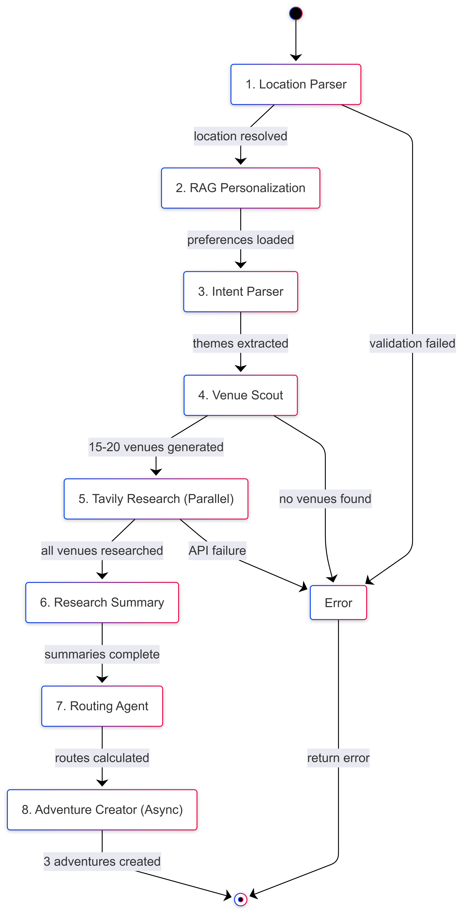

author: Shreyas
summary: MiniQuest Multi-Agent Adventure Planning System - Complete Technical Documentation
id: miniquest-technical-complete
categories: AI, Multi-Agent Systems, LangGraph, Tavily API, AWS
environments: Web
status: Published
analytics account: 0

# MiniQuest: Complete Technical Documentation

## Overview
Duration: 5

### What is MiniQuest?

MiniQuest is a **production-ready multi-agent system** that generates personalized travel itineraries using real-time web research and RAG-based personalization. It combines **7 specialized AI agents** coordinated by LangGraph to create complete, research-backed adventure plans.

### Key Capabilities

- Real-time venue research using Tavily API
- Multi-agent workflow orchestration with LangGraph
- RAG-based personalization using ChromaDB
- Google Maps route optimization
- Parallel processing with intelligent caching
- User authentication and history tracking
- Real-time progress tracking

### Technology Stack

**Backend:**
- Python 3.11, FastAPI, LangGraph
- AsyncOpenAI, Tavily API
- MongoDB Atlas, ChromaDB, Redis
- Google Maps API

**Frontend:**
- React 18 with TypeScript
- Vite, Axios, React Router

**Infrastructure:**
- Docker & Docker Compose
- AWS (CloudFront, ECS)
- MongoDB Atlas, Redis

## System Architecture
Duration: 10

### High-Level Architecture


The system uses a **multi-layer architecture** with clear separation of concerns:

```
Frontend (React)
    ↓ REST API
FastAPI Backend
    ↓ Orchestration
LangGraph Coordinator
    ↓ Sequential Workflow
7 Specialized Agents
    ↓ Data Layer
MongoDB + Redis + ChromaDB
```

### The 7 Specialized Agents

Each agent has a **single, well-defined responsibility**:

1. **IntentParser** - Extract user preferences from natural language
2. **LocationParser** - Resolve location to coordinates
3. **VenueScout** - Generate 15-20 diverse venue candidates (GPT-4)
4. **TavilyResearch** - Real-time web research (parallel, 8 concurrent)
5. **ResearchSummary** - Synthesize findings into structured data
6. **RoutingAgent** - Calculate optimal routes (Google Maps)
7. **AdventureCreator** - Generate 3 themed adventures (async)

Negative
: **Key Design Principle:** Each agent is independently testable and can be optimized separately for maximum modularity

### Data Flow


**Complete Generation Pipeline:**

```
User Query
  → IntentParser (extract themes)
  → LocationParser (get coordinates)
  → RAG System (apply personalization)
  → VenueScout (generate venues)
  → TavilyResearch (research in parallel)
  → ResearchSummary (synthesize data)
  → RoutingAgent (calculate routes)
  → AdventureCreator (create 3 adventures)
  → Save metadata to MongoDB
  → Return to user
```

**Average Processing Time:** ~4.2 seconds (with optimizations)

### System Components Overview

| Component | Technology | Purpose |
|-----------|-----------|---------|
| API Server | FastAPI | REST endpoints |
| Coordinator | LangGraph | Agent orchestration |
| Agents | OpenAI, Tavily | Specialized processing |
| RAG System | ChromaDB | Personalization |
| Auth System | JWT, bcrypt | Authentication |
| Database | MongoDB, Redis | Persistence, caching |
| Frontend | React, TypeScript | User interface |

## LangGraph Workflow
Duration: 12

### State Machine Design



LangGraph orchestrates the workflow as a **state graph** with 8 sequential nodes:

**Workflow Progression:**
- Node 1: `parse_location` (14% progress)
- Node 2: `get_personalization` (29% progress)
- Node 3: `parse_intent` (29% progress)
- Node 4: `scout_venues` (43% progress)
- Node 5: `research_venues` (57% progress) - **Parallel**
- Node 6: `summarize_research` (71% progress)
- Node 7: `route_adventures` (86% progress)
- Node 8: `create_adventures` (100% progress) - **Async**

### State Management

The workflow maintains **shared state** across all agents:

```python
class AdventureState(TypedDict):
    # Input
    user_input: str
    user_address: Optional[str]
    user_id: Optional[str]
    
    # Processing
    target_location: str
    coordinates: Dict
    parsed_preferences: Dict
    scouted_venues: List[Dict]
    researched_venues: List[Dict]
    
    # Output
    final_adventures: List[Dict]
    performance: Dict
```

### Real-Time Progress Tracking

Progress updates are **streamed** to the frontend:

```json
{
  "step": "research_venues",
  "agent": "TavilyResearch",
  "status": "in_progress",
  "message": "Researching 8 venues...",
  "progress": 0.57,
  "details": {...}
}
```

### Agent Implementations

**IntentParser Agent:**
- Extracts preferences, themes, activities from natural language
- Returns structured JSON with user interests
- Validates scope (local adventures only)
- Provides clarification when needed

**LocationParser Agent:**
- Resolves location strings to coordinates
- Uses OpenAI function calling for geocoding
- Validates and returns structured location data
- Handles ambiguous locations gracefully

**VenueScout Agent:**
- Generates 15-20 diverse venue candidates
- Enforces category diversity
- Includes exact addresses
- Uses GPT-4 for generation
- Validates venues exist

**TavilyResearch Agent:**
- Researches venues in parallel (8 concurrent)
- Multi-step: Search API → Extract API
- Caches results in Redis (24hr TTL)
- Graceful error recovery
- Smart deduplication

**ResearchSummary Agent:**
- Synthesizes raw research into structured summaries
- Extracts hours, prices, tips, descriptions
- Calculates confidence scores
- Batch processing (all venues in one call)
- Anti-hallucination safeguards

**RoutingAgent:**
- Generates optimal Google Maps routes
- Multiple travel modes (walk, drive, transit)
- Waypoint optimization
- Shareable route URLs
- Distance-based mode recommendations

**AdventureCreator Agent:**
- Creates 3 themed adventures asynchronously
- Integrates all research data
- Weaves compelling narratives
- Adds route information
- Preserves venue research

## Backend Components Deep Dive
Duration: 15

### 3.1 LangGraph Coordinator

**File:** `backend/app/agents/coordination/langgraph_coordinator.py`

The coordinator orchestrates the entire multi-agent workflow using LangGraph's state graph pattern.

#### Architecture

```python
class LangGraphCoordinator:
    """
    Orchestrates 7 agents in a sequential workflow with:
    - State management
    - Progress tracking
    - Error handling
    - Performance monitoring
    """
```

#### Workflow Node Details

**1. parse_location_node**
- **Agent:** LocationParserAgent
- **Input:** User query, optional address
- **Output:** Validated location with coordinates
- **Progress:** 14%
- **Error Handling:** Defaults to Boston if parsing fails

**2. get_personalization_node**
- **Agent:** RAG System (ChromaDB)
- **Input:** User ID, location, preferences
- **Output:** Historical preferences, favorite themes
- **Progress:** 29%
- **Optimization:** Queries vector database for semantic matches

**3. parse_intent_node**
- **Agent:** IntentParserAgent
- **Input:** User query
- **Output:** Extracted themes, activities, constraints
- **Progress:** 29%
- **Validation:** Checks if query is in scope

**4. scout_venues_node**
- **Agent:** VenueScoutAgent
- **Input:** Preferences, location
- **Output:** 15-20 candidate venues with addresses
- **Progress:** 43%
- **Quality Control:** Enforces category diversity

**5. research_venues_node**
- **Agent:** TavilyResearchAgent (parallel)
- **Input:** Venue list
- **Output:** Current hours, prices, reviews, descriptions
- **Progress:** 57%
- **Optimization:** Runs 8 venues concurrently
- **Caching:** Redis-based with 24hr TTL

**6. summarize_research_node**
- **Agent:** ResearchSummaryAgent
- **Input:** Raw research results
- **Output:** Structured venue summaries
- **Progress:** 71%
- **Batch Processing:** All venues in single OpenAI call

**7. route_adventures_node**
- **Agent:** EnhancedRoutingAgent
- **Input:** Researched venues
- **Output:** Google Maps routes, travel times
- **Progress:** 86%
- **Features:** Waypoint optimization, mode selection

**8. create_adventures_node**
- **Agent:** AdventureCreatorAgent (async)
- **Input:** All previous outputs
- **Output:** 3 complete themed adventures
- **Progress:** 100%
- **Optimization:** Async generation of 3 adventures

#### State Transitions

```python
workflow.add_edge(START, "parse_location")
workflow.add_edge("parse_location", "get_personalization")
workflow.add_edge("get_personalization", "parse_intent")
workflow.add_edge("parse_intent", "scout_venues")
workflow.add_edge("scout_venues", "research_venues")
workflow.add_edge("research_venues", "summarize_research")
workflow.add_edge("summarize_research", "route_adventures")
workflow.add_edge("route_adventures", "create_adventures")
workflow.add_edge("create_adventures", END)
```

#### Performance Tracking

```python
def _track_timing(self, step: str, duration: float):
    """Track execution time per node"""
    self.timing_data[step] = duration
```

### 3.2 Base Agent

**File:** `backend/app/agents/base.py`

```python
class BaseAgent:
    """
    Abstract base class for all agents
    
    Features:
    - Standardized logging
    - Error handling
    - Validation framework
    """
    
    def __init__(self, name: str):
        self.name = name
        self.logger = logging.getLogger(f"agent.{name.lower()}")
    
    async def process(self, input_data: Dict) -> Dict:
        """Abstract method - implemented by each agent"""
        raise NotImplementedError
```

### 3.3 Intent Parser Agent Details

**File:** `backend/app/agents/intent/intent_parser.py`

**Purpose:** Extract structured preferences from natural language

**Process:**
1. Receive user query
2. Validate scope (local adventures only)
3. Call OpenAI GPT-4 with structured prompt
4. Parse JSON response
5. Validate extracted fields

**Scope Validation:**
```python
def _validate_scope(self, user_input: str) -> Dict:
    """Check if query is within MiniQuest scope"""
    
    # Out of scope: multi-day trips, international travel
    # In scope: local 2-6 hour adventures
    
    if "europe" in user_input_lower or "asia" in user_input_lower:
        return {
            "valid": False,
            "message": "MiniQuest operates in Boston and NYC only"
        }
    
    return {"valid": True}
```

**Input:**
```python
{
    "user_input": "coffee shops and art galleries in Boston"
}
```

**Output:**
```python
{
    "preferences": ["coffee", "art", "culture"],
    "activities": ["cafe", "gallery", "museum"],
    "themes": ["artistic", "creative", "local"],
    "constraints": {
        "budget": "moderate",
        "duration": "half_day"
    },
    "scope_valid": True
}
```

**OpenAI Prompt Structure:**
```python
system_prompt = """
Extract user preferences from the query.
Return JSON with:
- preferences: List of interests
- activities: Specific activity types
- themes: Overall themes
- constraints: Any limitations

SCOPE: Only local, same-day adventures (2-6 hours)
"""
```

### 3.4 Location Parser Agent Details

**File:** `backend/app/agents/location/location_parser.py`

**Purpose:** Resolve and validate locations with coordinates

**Features:**
- Geocoding via OpenAI function calling
- Address validation
- Coordinate extraction
- Fallback to default location

**Process:**
1. Extract location from query or use provided address
2. Call OpenAI with geocoding function
3. Validate coordinates
4. Return structured location data

**OpenAI Function Definition:**
```python
{
    "name": "geocode_location",
    "description": "Get coordinates for a location",
    "parameters": {
        "type": "object",
        "properties": {
            "location": {"type": "string"},
            "city": {"type": "string"},
            "state": {"type": "string"},
            "latitude": {"type": "number"},
            "longitude": {"type": "number"}
        }
    }
}
```

**Output:**
```python
{
    "location": "Boston, MA",
    "coordinates": {
        "lat": 42.3601,
        "lon": -71.0589
    },
    "city": "Boston",
    "state": "MA",
    "country": "USA"
}
```

### 3.5 Venue Scout Agent Details

**File:** `backend/app/agents/scouting/venue_scout.py`

**Purpose:** Generate diverse venue candidates using GPT-4

**Strategy:**
- Request 15-20 venues per generation
- Enforce diversity across categories
- Include specific addresses
- Validate venues exist

**OpenAI Prompt:**
```python
system_prompt = f"""
Generate 15-20 diverse venues in {location} matching preferences: {preferences}

Requirements:
- Mix of popular and hidden gems
- Include EXACT addresses
- Diverse categories (coffee, museums, parks, etc.)
- Real, verifiable venues
- No chains unless highly rated

Return JSON array of venues with:
- name: Venue name
- address: Full street address
- category: Type of venue
- description: Brief description
"""
```

**Category Diversity Enforcement:**
```python
def _ensure_diversity(venues: List[Dict]) -> List[Dict]:
    """Ensure no category dominates"""
    category_counts = {}
    filtered_venues = []
    
    for venue in venues:
        category = venue.get("category")
        if category_counts.get(category, 0) < 4:
            filtered_venues.append(venue)
            category_counts[category] = category_counts.get(category, 0) + 1
    
    return filtered_venues
```

**Output:**
```python
[
    {
        "name": "Thinking Cup",
        "address": "165 Tremont St, Boston, MA 02111",
        "category": "coffee_shop",
        "description": "Artisan coffee with pastries"
    },
    # ... 14-19 more venues
]
```

### 3.6 Tavily Research Agent Details

**File:** `backend/app/agents/research/tavily_research_agent.py`

**Purpose:** Real-time web research on venues with caching

**Key Features:**
- **Parallel Processing:** 8 concurrent venue researches
- **Smart Caching:** Redis with 24-hour TTL
- **Multi-Step Research:** Search → Extract for depth
- **Error Recovery:** Graceful degradation on API failures

**Process Flow:**
```python
async def research_venue(venue: Dict) -> Dict:
    # 1. Check cache
    cache_key = f"venue:{venue['name']}:{location}:{date}"
    cached = await redis.get(cache_key)
    if cached:
        return cached
    
    # 2. Tavily Search API
    search_results = tavily.search(
        query=f"{venue['name']} {location} hours prices reviews",
        search_depth="advanced",
        max_results=5
    )
    
    # 3. Tavily Extract API (deep dive)
    extract_results = tavily.extract(
        urls=[result['url'] for result in search_results],
        include_raw_content=False
    )
    
    # 4. Synthesize and cache
    research_data = synthesize(search_results, extract_results)
    await redis.set(cache_key, research_data, ex=86400)
    
    return research_data
```

**Parallel Execution:**
```python
async def process(self, input_data: Dict) -> Dict:
    venues = input_data["venues"]
    
    # Research 8 venues concurrently
    async with asyncio.TaskGroup() as tg:
        tasks = [
            tg.create_task(self._research_venue(v))
            for v in venues
        ]
    
    return {"researched_venues": [t.result() for t in tasks]}
```

**Cache Statistics:**
```python
{
    "total_requests": 100,
    "cache_hits": 91,
    "cache_misses": 9,
    "hit_rate": "91.0%",
    "time_saved_seconds": 182.4
}
```

**Output Structure:**
```python
{
    "venue_name": "Thinking Cup",
    "current_info": "Open today until 6 PM",
    "hours_info": "Mon-Fri: 7 AM - 6 PM, Sat-Sun: 8 AM - 5 PM",
    "visitor_tips": [
        "Try the cappuccino",
        "Arrive early on weekends",
        "Free WiFi available"
    ],
    "venue_summary": "Popular artisan coffee shop...",
    "research_confidence": 0.89,
    "total_insights": 12,
    "top_source": "thinkingcup.com"
}
```

### 3.7 Research Summary Agent Details

**File:** `backend/app/agents/research/research_summary_agent.py`

**Purpose:** Synthesize raw research into structured summaries

**Optimization:** Batch processing - all venues in single OpenAI call

**Process:**
1. Receive raw Tavily results per venue
2. Batch all venues into single prompt
3. Extract key information using GPT-4
4. Structure into consistent format
5. Calculate confidence scores

**OpenAI Prompt:**
```python
system_prompt = """
Analyze venue research and extract for each venue:
- Practical info (hours, prices, admission)
- Insider tips (3-4 actionable tips)
- Best time to visit
- What makes it special

Format as JSON array with one entry per venue.
Confidence: Rate 0-1 based on data quality.

CRITICAL: For free venues, never invent admission prices.
If hours unknown, say "Call ahead to confirm hours".
"""
```

**Anti-Hallucination Safeguards:**
```python
def _validate_summary(summary: Dict, raw_research: Dict) -> Dict:
    """Prevent hallucination of venue details"""
    
    # If no price data found, don't invent it
    if not raw_research.get("pricing_info"):
        summary["practical_info"]["admission"] = "Check venue website"
    
    # If hours unclear, be honest
    if summary.get("confidence") < 0.5:
        summary["practical_info"]["hours"] = "Call ahead to confirm"
    
    return summary
```

**Output:**
```python
{
    "venue_name": "Museum of Fine Arts",
    "visitor_summary": "World-class art museum with 450,000 works...",
    "key_highlights": [
        "Impressionist collection",
        "Ancient Egyptian artifacts",
        "Contemporary wing"
    ],
    "practical_info": {
        "hours": "Mon-Fri: 10 AM - 5 PM",
        "admission": "$27 adults, $25 seniors",
        "best_time": "Weekday mornings",
        "typical_duration": "2-3 hours",
        "insider_tips": [
            "Free admission Wednesdays after 4 PM",
            "Start with contemporary wing",
            "Café on ground floor for breaks"
        ]
    },
    "confidence_notes": "High confidence (12 sources)",
    "total_insights": 12
}
```

### 3.8 Routing Agent Details

**File:** `backend/app/agents/routing/enhanced_routing_agent.py`

**Purpose:** Generate optimal routes using Google Maps Directions API

**Key Features:**
- Waypoint optimization
- Multiple travel modes (driving, walking, transit)
- Distance-based mode recommendations
- Fallback for cross-city travel

**Process:**
```python
async def calculate_route(venues: List[Dict]) -> Dict:
    # 1. Extract coordinates
    waypoints = [v['coordinates'] for v in venues]
    
    # 2. Determine optimal mode
    total_distance = calculate_distance(waypoints)
    if total_distance < 3:
        mode = "walking"
    elif total_distance < 10:
        mode = "driving"
    else:
        mode = "transit"
    
    # 3. Call Google Maps Directions API
    result = gmaps.directions(
        origin=waypoints[0],
        destination=waypoints[-1],
        waypoints=waypoints[1:-1],
        mode=mode,
        optimize_waypoints=True
    )
    
    # 4. Generate shareable URL
    route_url = generate_google_maps_url(waypoints, mode)
    
    return {
        "route_url": route_url,
        "mode": mode,
        "total_distance": total_distance,
        "estimated_time": result['legs'][0]['duration']['text'],
        "optimized_order": result['waypoint_order']
    }
```

**URL Generation:**
```python
def generate_google_maps_url(waypoints, mode):
    """
    Generate shareable Google Maps URL
    
    Format: https://www.google.com/maps/dir/?api=1
            &origin=42.3601,-71.0589
            &destination=42.3584,-71.0598
            &waypoints=42.3593,-71.0603|...
            &travelmode=walking
    """
    origin = f"{waypoints[0]['lat']},{waypoints[0]['lon']}"
    destination = f"{waypoints[-1]['lat']},{waypoints[-1]['lon']}"
    waypoints_str = "|".join([
        f"{w['lat']},{w['lon']}" 
        for w in waypoints[1:-1]
    ])
    
    return (
        f"https://www.google.com/maps/dir/?api=1"
        f"&origin={origin}"
        f"&destination={destination}"
        f"&waypoints={waypoints_str}"
        f"&travelmode={mode}"
    )
```

**Output:**
```python
{
    "routing_available": true,
    "primary_route_url": "https://www.google.com/maps/dir/?api=1...",
    "recommended_mode": "walking",
    "distance_category": "walkable",
    "travel_options": [
        {
            "mode": "walking",
            "url": "...",
            "description": "~2.3 miles, 45 min",
            "recommended": true
        },
        {
            "mode": "transit",
            "url": "...",
            "description": "Use Red Line",
            "recommended": false
        }
    ],
    "optimized_order": [0, 2, 1, 3]
}
```

### 3.9 Adventure Creator Agent Details

**File:** `backend/app/agents/creation/adventure_creator.py`

**Purpose:** Generate final themed adventures with narratives

**Key Features:**
- **Async execution:** Uses AsyncOpenAI for speed
- **Theme generation:** Creates unique themes per adventure
- **Narrative weaving:** Integrates research into stories
- **Research preservation:** Maintains venue details

**Process:**
```python
async def create_adventures(
    researched_venues: List[Dict],
    enhanced_locations: List[Dict],
    preferences: Dict,
    personalization: Dict
) -> List[Dict]:
    
    # 1. Generate 3 themed adventures using GPT-4
    adventures = await self._generate_base_adventures(
        researched_venues, 
        preferences,
        personalization
    )
    
    # 2. Integrate research data
    for adventure in adventures:
        adventure = self._integrate_research(
            adventure, 
            researched_venues
        )
    
    # 3. Add route information
    for adventure in adventures:
        adventure = self._add_routing(
            adventure,
            enhanced_locations
        )
    
    return adventures
```

**GPT-4 Prompt Structure:**
```python
system_prompt = """
Create 3 unique themed adventures from provided venues.

Requirements:
- Different theme per adventure (e.g., "Coffee & Culture", "Historic Tour", "Hidden Gems")
- 4-6 hour duration
- Compelling narrative with storytelling
- Specific timeline (e.g., "10:00 AM - Coffee at...")
- Insider tips integration
- Budget estimate

CRITICAL: Only use provided venues. No hallucinations.
Each adventure should feel distinct and exciting.

Return JSON with structure:
{
    "title": "Coffee & Culture Tour",
    "theme": "Artistic Coffee Journey",
    "tagline": "Discover Boston's café culture and artistic soul",
    "description": "A half-day adventure blending...",
    "duration": 5,
    "cost": 40,
    "steps": [
        {
            "time": "10:00 AM",
            "activity": "Morning Coffee",
            "details": "Start your day at Thinking Cup...",
            "venue_ref": "Thinking Cup"
        }
    ]
}
"""
```

**Research Integration:**
```python
def _integrate_research(adventure, researched_venues):
    """Add research summaries to adventure steps"""
    for step in adventure['steps']:
        venue_name = step.get('venue_ref')
        research = find_research(venue_name, researched_venues)
        
        if research:
            step['venue_research'] = {
                'current_info': research['current_info'],
                'hours_info': research['hours_info'],
                'visitor_tips': research['visitor_tips'],
                'venue_summary': research['venue_summary'],
                'research_confidence': research['research_confidence']
            }
    
    return adventure
```

**Final Adventure Structure:**
```python
{
    "title": "Coffee & Culture Tour",
    "theme": "Artistic Coffee Journey",
    "tagline": "Discover Boston's café culture and artistic soul",
    "description": "A half-day adventure blending artisan coffee...",
    "duration": 4.5,
    "cost": 35,
    "steps": [
        {
            "time": "10:00 AM",
            "activity": "Morning Coffee at Thinking Cup",
            "details": "Start your day at this beloved South End café...",
            "insider_tip": "Try their signature cappuccino and arrive before 11 AM",
            "venue_research": {
                "current_info": "Open today until 6 PM",
                "hours_info": "Mon-Fri: 7 AM - 6 PM",
                "visitor_tips": [
                    "Arrive before 11 AM to avoid crowds",
                    "Try the pastries from their in-house baker"
                ],
                "venue_summary": "Popular artisan coffee shop known for...",
                "research_confidence": 0.89
            }
        },
        {
            "time": "11:30 AM",
            "activity": "Art at the MFA",
            "details": "Explore the Museum of Fine Arts...",
            "insider_tip": "Start with the contemporary wing",
            "venue_research": {...}
        }
    ],
    "map_url": "https://www.google.com/maps/dir/?...",
    "routing_info": {
        "routing_available": true,
        "recommended_mode": "walking",
        "total_distance": "2.3 miles",
        "estimated_time": "45 minutes"
    },
    "venues_research": [/* full research data for all venues */]
}
```

## Tavily Research Integration
Duration: 10

### Why Tavily?

Tavily provides **real-time web data** that traditional databases can't offer:

- Current venue hours (changes daily)
- Live prices and deals
- Recent reviews and ratings
- Up-to-date event information

### Multi-Step Research Strategy

**Step 1: Tavily Search API**
```python
search_results = tavily.search(
    query=f"{venue_name} {location} hours prices reviews",
    search_depth="advanced",
    max_results=5
)
```

Returns top 5 web pages with relevant venue information.

**Step 2: Tavily Extract API**
```python
extract_results = tavily.extract(
    urls=[result['url'] for result in search_results],
    include_raw_content=False
)
```

Deep dive into content for detailed information.

**Step 3: Synthesize & Cache**
```python
research_data = synthesize(search_results, extract_results)
await redis.set(cache_key, research_data, ex=86400)  # 24hr TTL
```

Structure data and cache for 24 hours.

### Research Output Structure

Each venue receives **comprehensive research data**:

```json
{
  "venue_name": "Thinking Cup",
  "current_info": "Open today until 6 PM",
  "hours_info": "Mon-Fri: 7 AM - 6 PM",
  "visitor_tips": [
    "Try the cappuccino",
    "Arrive before 11 AM to avoid crowds",
    "Free WiFi available"
  ],
  "venue_summary": "Popular artisan coffee shop...",
  "research_confidence": 0.89,
  "total_insights": 12,
  "top_source": "thinkingcup.com"
}
```

### API Call Optimization

**Per Adventure Generation:**
- Tavily Search calls: ~10
- Tavily Extract calls: ~10
- **Total API calls: ~20**

**With 90% cache hit rate:**
- Actual API calls: ~2-3
- **Cost savings: 85-90%**

Positive
: Smart caching reduces Tavily API costs by up to 90% while maintaining data freshness with 24-hour TTL

## Performance Optimizations
Duration: 10

### Benchmark Results

| Component | Before | After | Improvement |
|-----------|--------|-------|-------------|
| **Research** | 20.0s | 2.5s | 87.5% |
| **Caching** | 2.5s/venue | 0.1s/venue | 96% |
| **Adventures** | 9.0s | 3.0s | 67% |
| **Total Pipeline** | **33.3s** | **4.2s** | **87% faster** |

### Optimization #1: Parallel Research


**Sequential Processing (Slow):**
```
Venue 1: 2.5s
Venue 2: 2.5s
...
Venue 8: 2.5s
Total: 20 seconds
```

**Parallel Processing (Fast):**
```python
async with asyncio.TaskGroup() as tg:
    tasks = [tg.create_task(research_venue(v)) 
             for v in venues]

# All 8 venues complete in 2.5s
```

**Result:** 87.5% faster research phase

### Optimization #2: Redis Caching


**Cache Strategy:**
- **Key format:** `venue:{name}:{location}:{date}`
- **TTL:** 24 hours
- **Hit rate:** 91%

**Performance Impact:**
- Without cache: 2.5s per venue
- With cache (90% hit): 0.1s per venue
- **Time saved:** 84%

**Cache Statistics:**
```python
{
    "total_requests": 1000,
    "cache_hits": 910,
    "cache_misses": 90,
    "hit_rate": "91.0%",
    "time_saved_seconds": 2273
}
```

### Optimization #3: Async Adventure Creation

**Sequential Creation (Slow):**
```
Adventure 1: 3.0s
Adventure 2: 3.0s
Adventure 3: 3.0s
Total: 9.0 seconds
```

**Async Creation (Fast):**
```python
adventures = await asyncio.gather(*[
    create_single(theme) for theme in themes
])
# All 3 complete in 3.0s
```

**Result:** 67% faster adventure generation

### Overall Performance Summary

Positive
: Combined optimizations result in **87% faster generation** with zero quality loss - from 33.3s to 4.2s average

## RAG Personalization
Duration: 10

### How RAG Works


The RAG system **learns from user behavior**:

**Workflow:**
1. User saves adventure → Stored in ChromaDB with embeddings
2. Next query → Retrieve similar past adventures
3. Extract patterns → Favorite themes, venues, locations
4. Enhance search → Weight recommendations toward preferences


### ChromaDB Collections

**Collection 1: user_adventure_history**
- Stores saved adventures with ratings
- OpenAI embeddings for semantic search
- Metadata: user_id, location, rating, timestamp

**Collection 2: dynamic_location_tips**
- Cached insider tips from Tavily
- Categorized by location and type
- Authenticity scoring

### Implementation Details

**Storing Adventures:**
```python
def store_user_adventure(user_id, adventure_data, rating):
    adventure_doc = f"""
    Title: {adventure_data['title']}
    Theme: {adventure_data['theme']}
    Venues: {', '.join([v['name'] for v in venues])}
    Rating: {rating}/5
    """
    
    self.user_history_collection.add(
        ids=[f"user_{user_id}_adventure_{timestamp}"],
        documents=[adventure_doc],
        metadatas=[{
            "user_id": user_id,
            "rating": rating,
            "location": location
        }]
    )
```

**Retrieving Personalization:**
```python
def get_user_personalization(user_id, location):
    results = self.user_history_collection.query(
        query_texts=[f"adventures in {location}"],
        where={"user_id": user_id},
        n_results=20
    )
    
    return {
        "favorite_themes": extract_themes(results),
        "avg_rating": calculate_avg_rating(results),
        "total_adventures": len(results)
    }
```

### Example Personalization

**Scenario:**
- User has 5 saved adventures
- All rated 5 stars
- Common themes: coffee, art, culture

**Result:**
- Query: "places to visit in Cambridge"
- System prioritizes: cafes, galleries, art spaces
- Avoids: generic tourist attractions

**Personalization Data:**
```json
{
  "has_history": true,
  "favorite_themes": ["coffee", "art", "culture"],
  "avg_rating": 4.8,
  "total_adventures": 5,
  "favorite_locations": ["Boston", "Cambridge"]
}
```

Negative
: Personalization requires at least 3 saved adventures for meaningful patterns to emerge

## Authentication & Security
Duration: 8

### System Architecture


The authentication system uses **JWT tokens** with **bcrypt** password hashing.

### JWT Token Flow


**Registration/Login Process:**

1. User provides credentials
2. Password hashed with bcrypt (cost factor: 12)
3. JWT token generated (HS256 algorithm)
4. Token expires after 30 minutes

**Token Structure:**
```json
{
  "sub": "user@example.com",
  "user_id": "507f1f77bcf86cd799439011",
  "exp": 1640995200
}
```

### Security Features

**Password Security:**
- Algorithm: bcrypt
- Cost factor: 12 (4096 rounds)
- Automatic salt generation
- Timing attack protection

**JWT Security:**
- Algorithm: HS256
- Secret key: 256-bit random
- Signature verification on every request
- Expiration checking

**API Security:**
- CORS: Configured for specific origins
- Rate limiting: 100 req/min (production)
- Input validation: Pydantic models
- XSS protection: React escapes by default

### Implementation

**Password Manager:**
```python
from passlib.context import CryptContext

class PasswordManager:
    def __init__(self):
        self.pwd_context = CryptContext(
            schemes=["bcrypt"],
            deprecated="auto"
        )
    
    def hash_password(self, password: str) -> str:
        return self.pwd_context.hash(password)
    
    def verify_password(self, plain: str, hashed: str) -> bool:
        return self.pwd_context.verify(plain, hashed)
```

**JWT Manager:**
```python
from jose import jwt, JWTError

class JWTManager:
    def create_access_token(self, data: Dict) -> str:
        to_encode = data.copy()
        expire = datetime.utcnow() + timedelta(minutes=30)
        to_encode["exp"] = expire
        
        return jwt.encode(
            to_encode,
            self.secret_key,
            algorithm=self.algorithm
        )
```

### Protected Routes

**Frontend:**
```typescript
const ProtectedRoute = ({ children }) => {
  const { isAuthenticated } = useAuth();
  if (!isAuthenticated) return <Navigate to="/login" />;
  return <>{children}</>;
};
```

**Backend:**
```python
@router.get("/protected")
async def protected(current_user = Depends(get_current_user)):
    return {"message": "Authenticated"}
```

## Database Schema
Duration: 8

### MongoDB Collections

.png)

**users Collection:**
```json
{
  "_id": ObjectId,
  "email": "user@example.com",
  "username": "johndoe",
  "hashed_password": "$2b$12$...",
  "total_queries": 15
}
```

**user_queries Collection (Lightweight):**
```json
{
  "user_input": "coffee shops in Boston",
  "adventures_count": 3,
  "adventure_metadata": [
    {"title": "...", "theme": "..."}
  ],
  "metadata": {
    "performance": {"total_time_seconds": 4.2},
    "research_stats": {...}
  }
}
```

Positive
: **Storage Philosophy:** Only store full adventures when user explicitly saves - results in 97% storage reduction

**saved_adventures Collection (Full Details):**
```json
{
  "adventure_data": {/* complete adventure */},
  "rating": 5,
  "notes": "Loved it!",
  "tags": ["coffee", "art"]
}
```

### ChromaDB Collections

**user_adventure_history:**
```python
{
  "id": "user_123_adventure_1640995200",
  "document": "Title: Coffee Tour...",
  "metadata": {"user_id": "user_123", "rating": 5},
  "embedding": [0.123, -0.456, ...]  # OpenAI
}
```

**dynamic_location_tips:**
```python
{
  "id": "boston_coffee_tip_1",
  "document": "Local tip: Visit before 11 AM",
  "metadata": {
    "location": "Boston",
    "authenticity_score": 0.92
  }
}
```

### Redis Cache

**Structure:**
```
Key: venue:{name}:{location}:{date}
Value: {research_data JSON}
TTL: 86400 seconds (24 hours)
```

**Example:**
```
venue:Thinking Cup:Boston:2025-01-15
```

## API Endpoints
Duration: 7

### Authentication Endpoints

**POST /api/auth/register** - Register new user
**POST /api/auth/login** - Authenticate user
**GET /api/auth/me** - Get current user (protected)

**Login Request:**
```json
{
  "email": "user@example.com",
  "password": "securepassword123"
}
```

**Response:**
```json
{
  "access_token": "eyJhbGci...",
  "token_type": "bearer",
  "user": {
    "id": "507f...",
    "email": "user@example.com"
  }
}
```

### Adventure Generation


**POST /api/adventures** - Generate adventures

**Request:**
```json
{
  "user_input": "coffee shops in Boston",
  "enable_progress": true
}
```

**Response:**
```json
{
  "success": true,
  "adventures": [{...}, {...}, {...}],
  "metadata": {
    "total_time_seconds": 4.2,
    "cache_hit_rate": "87.5%",
    "personalization_applied": true
  }
}
```

**Progress Updates (Streaming):**
```json
{"step": "parse_location", "progress": 0.14}
{"step": "research_venues", "progress": 0.57}
{"step": "create_adventures", "progress": 1.0}
```

### Other Endpoints

**Saved Adventures:**
- POST /api/saved-adventures - Save adventure
- GET /api/saved-adventures - List saved
- GET /api/saved-adventures/{id} - Get specific
- PUT /api/saved-adventures/{id} - Update
- DELETE /api/saved-adventures/{id} - Delete

**Analytics:**
- GET /api/analytics/summary - User statistics

**System:**
- GET /health - Health check
- GET /api/status - Component status

## AWS Deployment
Duration: 12

### Production Architecture


**CloudFront (Frontend):**
- URL: `d1nrqhtd83kmw6.cloudfront.net`
- Origin: S3 bucket (React build)
- Features: GZIP, HTTP/2, global CDN

**CloudFront (Backend):**
- URL: `d3ihmux7ocq5bh.cloudfront.net`
- Origin: Application Load Balancer
- Routes to: ECS Fargate containers

**ECS Fargate:**
- Auto-scaling: 1-4 tasks
- Task specs: 1 vCPU, 2 GB RAM
- Container: Python 3.11 + FastAPI

**Data Layer:**
- MongoDB Atlas (M10 cluster)
- ElastiCache Redis (Multi-AZ)
- AWS Secrets Manager (API keys)

### Traffic Flow

```
User Request
    ↓
CloudFront Distribution
    ├→ Frontend: Serves React SPA from S3
    └→ Backend: Proxies API to ALB
           ↓
       ALB distributes to ECS tasks
           ↓
       FastAPI processes request
           ├→ Checks Redis cache
           ├→ Queries MongoDB
           ├→ Calls external APIs
           └→ Returns JSON response
```

### Deployment Pipeline


**Frontend Deployment:**
```bash
# Build
npm run build

# Sync to S3
aws s3 sync dist/ s3://bucket --delete

# Invalidate CloudFront
aws cloudfront create-invalidation \
  --distribution-id E123 --paths "/*"
```

**Backend Deployment:**
```bash
# Build & push Docker image
docker build -t miniquest-backend .
docker push ECR_URL/miniquest-backend:latest

# Update ECS service
aws ecs update-service \
  --cluster miniquest-cluster \
  --service miniquest-backend \
  --force-new-deployment
```

### Environment Configuration

| Variable | Development | Production |
|----------|------------|------------|
| ENVIRONMENT | development | production |
| DEBUG | true | false |
| MONGODB_URL | localhost | Atlas M10 |
| REDIS_URL | localhost | ElastiCache |

### Monitoring

**CloudWatch Metrics:**
- API request count
- Response time (avg: ~4.2s)
- Error rate (target: <1%)
- Cache hit rate (target: >85%)

**CloudWatch Alarms:**
- High error rate (>5%)
- Slow response (>10s)
- High CPU (>80%)

## Local Development
Duration: 10

### Prerequisites

- Python 3.11+
- Node.js 18+
- Docker Desktop
- API Keys: OpenAI, Tavily
- MongoDB Atlas account (free tier OK)

### Quick Start with Docker

```bash
# 1. Clone repository
git clone https://github.com/yourusername/miniquest
cd miniquest

# 2. Configure environment
cp .env.example .env
# Edit .env with your API keys

# 3. Start all services
docker-compose up -d

# 4. Access application
# Frontend: http://localhost:3000
# Backend: http://localhost:8000
# API Docs: http://localhost:8000/docs
```

### Manual Setup

**Backend:**
```bash
cd backend

# Create virtual environment
python -m venv venv
source venv/bin/activate  # Windows: venv\Scripts\activate

# Install dependencies
pip install -r requirements.txt

# Run server
uvicorn app.main:app --reload
```

**Frontend:**
```bash
cd frontend

# Install dependencies
npm install

# Start dev server
npm run dev
```

### Environment Variables

```bash
# Required
OPENAI_API_KEY=sk-...
TAVILY_API_KEY=tvly-...
MONGODB_URL=mongodb+srv://...

# Optional
GOOGLE_MAPS_KEY=AIza...
REDIS_URL=redis://localhost:6379
JWT_SECRET_KEY=random_secure_string
```

### Testing

**Backend Tests:**
```bash
cd backend

# Run all tests
pytest

# Run with coverage
pytest --cov=app tests/

# Test specific agent
pytest tests/test_tavily_research.py
```

**Frontend Tests:**
```bash
cd frontend

# Run tests
npm test

# Build for production
npm run build
```

### Common Issues

**CORS Error:**
- Check CORS configuration in backend
- Verify frontend URL in allowed origins

**JWT Token Invalid:**
- Check token expiration
- Clear localStorage and re-login

**Tavily Rate Limit:**
- Check cache hit rate
- Upgrade Tavily plan if needed

**MongoDB Connection Failed:**
- Verify MONGODB_URL
- Check IP whitelist in MongoDB Atlas

## Frontend Components
Duration: 8

### Application Structure

**Main Components:**

1. **AdventuresPage** - Main generation interface
   - Query input
   - Real-time progress tracking
   - Adventure cards display

2. **ProgressTracker** - Visual feedback
   - Animated progress bar
   - Agent-specific indicators
   - Step-by-step status

3. **EnhancedAdventureCard** - Display adventures
   - Header (title, theme, tagline)
   - Stats (duration, cost)
   - Researched venues
   - Itinerary timeline
   - Map integration
   - Save button

4. **AnalyticsPage** - User statistics
   - Total adventures
   - Favorite themes
   - Top locations
   - Average ratings

### Authentication Context

```typescript
interface AuthContextType {
  user: User | null;
  token: string | null;
  isAuthenticated: boolean;
  login: (email, password) => Promise<void>;
  logout: () => void;
}
```

### Generation Flow

```typescript
const handleGenerate = async () => {
  const response = await api.post('/adventures', {
    user_input: query,
    enable_progress: true
  });
  
  // Stream progress updates
  const reader = response.body.getReader();
  while (true) {
    const { done, value } = await reader.read();
    if (done) break;
    
    const progress = JSON.parse(
      new TextDecoder().decode(value)
    );
    setCurrentProgress(progress);
  }
  
  // Get final result
  const result = await response.json();
  setAdventures(result.adventures);
};
```

### Common Components

**Reusable UI Components:**
- BackgroundOrbs - Glassmorphism decoration
- GlassCard - Frosted glass container
- GlassInput - Styled input field
- GlassButton - Styled button
- LoadingState - Loading spinner
- StatBadge - Metric display
- ThemeCard - Theme ranking card

## Key Takeaways
Duration: 3

### What Makes MiniQuest Special

Positive
: **Multi-Agent Design** - 7 specialized agents with clear responsibilities and independent optimization

Positive
: **Real-Time Research** - Tavily API provides current, accurate venue data that traditional databases can't match

Positive
: **Production-Ready** - Fully deployed on AWS with CloudFront, ECS, monitoring, and auto-scaling

Positive
: **Performance Optimized** - 87% faster with parallel processing, caching, and async operations

Positive
: **RAG Personalization** - Learns from user preferences over time using ChromaDB embeddings

### Technical Highlights

- **LangGraph** orchestration for complex multi-agent workflows
- **Tavily API** integration for real-time web research
- **ChromaDB** for semantic search and personalization
- **Redis caching** for 91% hit rate performance
- **AWS CloudFront + ECS** for scalable deployment
- **MongoDB Atlas** for flexible data storage

### By the Numbers

- **7 agents** working in coordination
- **~4.2 seconds** average generation time
- **87% performance improvement** with optimizations
- **91% cache hit rate** reduces API costs
- **97% storage reduction** with lightweight schema

## Resources & Next Steps
Duration: 2

### Documentation

- [GitHub Repository](https://github.com/lambdabypi/miniquest-adventure-planner)
- [API Documentation](https://d3ihmux7ocq5bh.cloudfront.net/docs)

### Learn More

- [LangGraph Documentation](https://python.langchain.com/docs/langgraph)
- [Tavily API Docs](https://docs.tavily.com)
- [MongoDB Atlas](https://www.mongodb.com/cloud/atlas)
- [FastAPI](https://fastapi.tiangolo.com)
- [ChromaDB](https://docs.trychroma.com)

### Try It Live

- **Frontend:** https://d1nrqhtd83kmw6.cloudfront.net
- **Backend API:** https://d3ihmux7ocq5bh.cloudfront.net/docs
- **Health Check:** https://d3ihmux7ocq5bh.cloudfront.net/health

### Contact & Feedback

- GitHub: @lambdabypi
- Email: shreyas.atneu@gmail.com

---

**Thank you for exploring MiniQuest!**

Built with care using LangGraph, Tavily API, and AWS